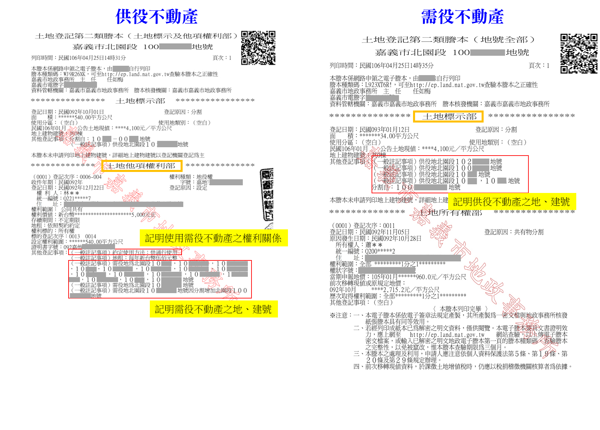

# 不動產役權登記重點整理,曾榮耀老師

## 文章資訊
- 文章編號：409179
- 作者：曾榮耀
- 發布日期：2017/05/02
- 爬取時間：2025-02-02 13:51:56
- 原文連結：[閱讀原文](https://real-estate.get.com.tw/Columns/detail.aspx?no=409179)

## 內文
各位同學們好
今天專欄來談談
不動產役權登記
以謄本來說明，強化大家印象
首先，根據土地登記規則第109條：
不動產役權設定登記時，應於供役不動產登記簿之他項權利部辦理登記，並於其他登記事項欄記明需役不動產之地、建號及使用需役不動產之權利關係；同時於需役不動產登記簿之標示部其他登記事項欄記明供役不動產之地、建號。
前項登記，需役不動產屬於他登記機關管轄者，供役不動產所在地之登記機關應於登記完畢後，通知他登記機關辦理登記。
將其整理後：
於供役不動產登記簿之他項權利部登記+記明需役不動產之地、建號及使用需役不動產之權利關係。
於需役不動產登記簿之標示部其他登記事項欄記明供役不動產之地、建號。
首先，當然在供役不動產之他項權利簿登記，因為該地是被設定他項權利者。而需役不動產並沒有被設定他項權利，但不動產役權有從屬性，須與供役不動產產生連結性，故須於標示部記明是哪筆供役不動產。
此外，提供相關謄本給各位參考（如圖），就更清楚，也不會搞錯了

---
*注：本文圖片存放於 ./images/ 目錄下*
