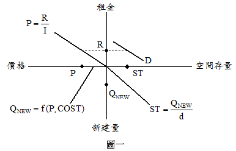
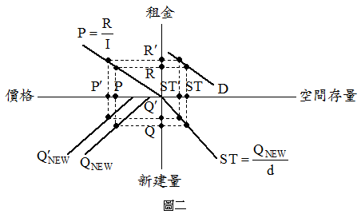

# 國土計畫法之實施對不動產市場之影響,許文昌老師

## 文章資訊
- 文章編號：409249
- 作者：許文昌
- 發布日期：2017/06/01
- 爬取時間：2025-02-02 13:51:56
- 原文連結：[閱讀原文](https://real-estate.get.com.tw/Columns/detail.aspx?no=409249)

## 內文
國土計畫法將全國土地分為國土保育地區、海洋資源地區、農業發展地區及城鄉發展地區等四種，土地使用管制較以往更為嚴格。又辦理用地變更，申請使用許可，應向中央主管機關繳交「國土保育費」，另向直轄市、縣(市)主管機關繳交「影響費」，土地變更之回饋較以往更多。
茲運用住宅存量流量模型(stock-flow model)分析國土計畫法之實施對不動產市場之影響：
(一)住宅存量流量模型：如圖一所示，首先，在第一象限，假設短期住宅供給量固定（ST），由住宅空間需求決定租金水準（R）。其次，在第二象限，將租金水準以資本還原率（I）還原為住宅價格（P）。接著，在第三象限，由住宅價格與新建住宅成本（成本收入）決定新建住宅數量（Q
NEW
）。最後，在第四象限，由新建住宅數量，減去原住宅存量之折舊數量（即d×ST，d代表折舊率），即得新增空間存量（△ST）。如△ST=0，則第一象限之空間存量不變；△ST>0，則第一象限之空間存量增加；△ST<0，則第一象限之空間存量減少。假定△ST=0，則連接ST、R、P與Q
NEW
之虛線，形成均衡狀態。

(二)國土計畫法之影響：實施國土計畫法，土地使用管制較以往更為嚴格，土地變更負擔較以往更為沉重，因此新建住宅成本提高，第三象限的Q
NEW
向左平行移動至Q’
NEW
，如圖二所示。原有均衡狀態（速接R、P、Q與ST之虛線）改變為新的均衡狀態（連接R’、P’、Q’與ST’之虛線）。因此，市場租金由R上漲為R’，住宅價格由P上漲為P’，住宅新建量由Q減少為Q’，空間存量由ST減少為ST’。

---
*注：本文圖片存放於 ./images/ 目錄下*
