# 合建分配比之估計,許文昌老師

## 文章資訊
- 文章編號：410203
- 作者：許文昌
- 發布日期：2017/11/09
- 爬取時間：2025-02-02 13:52:23
- 原文連結：[閱讀原文](https://real-estate.get.com.tw/Columns/detail.aspx?no=410203)

## 內文
(一)估計方法：
合建權益分配之當事人為地主方與建設方。地主方提供土地，建設方投入建築。前者以比較法及土地開發分析法評估土地價格（以A表示），後者以成本法評估建築成本（以B表示），則地主方之合建分配比為

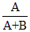

，建設方之合建分配比為

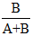

。
土地價格：以比較法估得比較價格，再以土地開發分析法估得土地開發分析價格，再就此二種價格加權平均後得到土地價格。
建築成本：建築成本僅計入營造施工費、規劃設計費及管理費等三項，其餘如廣告費、銷售費、稅捐、資本利息及建築利潤等不計入。不計入之理由在求兩造雙方之公平。
(二)估計合建分配比之影響因素：
估計合建分配比之主要影響因素如下：
房價：房價愈高，土地開發分析價格愈高，造成地主方之合建分配比提高。
容積率：容積率愈高，土地開發分析價格愈高，造成地主方之合建分配比提高。
營造施工費：營造施工費愈高，對地主方而言，土地開發分析價格愈低；對建設方而言，建築成本愈高，最後造成地主方之合建分配比降低。由此可知，營造施工費之變動造成雙重影響，影響甚鉅，最為關鍵。
(三)多數地主之合建分配比：
設建築基地由四筆土地整合而成，地主方分別為甲、乙、丙、丁，土地價格分別為A
1
、A
2
、A
3
、A
4
。四筆土地整合後之土地價格為A。另，建設方之建築成本為B。合建分配比有兩種估計方法：
第一種方法：
地主方甲之合建分配比：

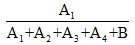

地主方乙之合建分配比：

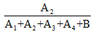

地主方丙之合建分配比：

地主方丁之合建分配比：

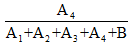

建設方之合建分配比：

第二種方法：
地主方甲之合建分配比：

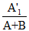

其中：

地主方乙之合建分配比：

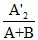

其中：

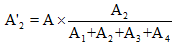

地主方丙之合建分配比：

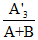

其中：

地主方丁之合建分配比：

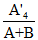

其中：

又，

建設方之合建分配比：

綜上，第一種方法，土地整合利益由建設方享有，故對建設方有利，但對地主方不利；第二種方法，土地整合利益由地主方享有，故對地主方有利，但對建設方不利。
例如：某建設公司擬在一塊建築基地進行合建，這塊建築基地由A、B、C三筆土地構成，地主分別為甲、乙、丙。經評估結果A地總價為2,000萬元，B地總價為3,000萬元，C地總價為4,000萬元，三筆土地合併後評估總價為10,000萬元。另，經評估建設公司投入建築成本為5,000萬元，則其合建分配比如下：
第一種方法：
地主方或建設方
提供土地價格
或投入建築成本（萬元）
合建分配比（%）
甲
2,000
14.29
乙
3,000
21.43
丙
4,000
28.57
建設公司
5,000
35.71
合計
14,000
100
第二種方法：
地主方或建設方
提供土地價格
或投入建築成本（萬元）
調整後提供土地價格
或投入建築成本（萬元）
合建分配比（%）
甲
2,000

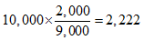

14.81
乙
3,000

22.22
丙
4,000

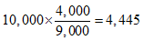

29.63
建設公司
5,000
5,000
33.34
合計
14,000
15,000
100

---
*注：本文圖片存放於 ./images/ 目錄下*
