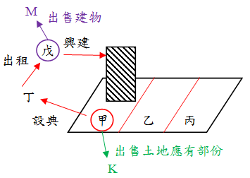

# 土地法第104條實例解析,曾榮耀老師

## 文章資訊
- 文章編號：410529
- 作者：曾榮耀
- 發布日期：2017/12/21
- 爬取時間：2025-02-02 13:52:25
- 原文連結：[閱讀原文](https://real-estate.get.com.tw/Columns/detail.aspx?no=410529)

## 內文
各位同學好
因有許多同學詢問104年普考的一題土地法實例如何回答，本週專欄統一予以說明，提供同學參考：
[考題]
甲、乙、丙三人分別共有基地一筆，應有部分均等且三人定有分管契約，茲甲將其應有（特定）部分土地（下稱系爭土地）設定典權予丁，丁未建屋旋即出租予戊，戊依法於其上建有建物一棟（下稱系爭建物）。試依據土地法第104條相關規定，回答下述問題：
(一)甲於典權與租賃存續期間擬出售系爭土地予第三人時，乙、丁與戊均欲行使先買權，誰之先買權優先？理由為何？
(二)戊於典權與租賃存續期間擬出售系爭建物予第三人時，甲、丙與丁均欲行使先買權，誰之先買權優先？理由為何？

[曾榮耀老師擬答]
確認各關係人：甲、乙、丙分別為共有人；丁為典權人；戊為典物承租人及建物所有權人。(根據民法§915典權存續中，典權人得將典物轉典或出租於他人)
今甲於典權與租賃存續期間擬出售系爭土地予第三人時，認為應以戊之優先購買權為最優先，乙次之：
(1)乙為共有人，其優先購買權權源為土§34-1，根據土§34-1第四項…，效力屬於債權效力。
(2)丁為典權人，其優先購買似有所疑義，可從兩個面向討論：
從文義上解釋，其優先購買權權源為土§104，根據土§104…，因具有土地利用之考量，屬於物權效力。而當物權與債權之優先購買權競合時，以物權優先，故丁應優先於乙。
然而，從目的上而言，依70年台上字第4312號、86年台上字第1251號基地承租人或地上權人，
如於基地上根本未為房屋之建築者，當無該條規定之適用
，係因土§104之意旨在於基地與其上使用之房屋能同屬一所有權人，而丁並非該建物之所有權人，應無適用之餘地。
(3)戊應為土§104之優先適用對象，可從兩個面向討論：
以文義解釋，根據土§104所適用之優先購買權人為地上權人、典權人及承租人，而該承租人從文義似限縮為租用基地建築房屋之承租人。此外，基地所有權人甲與基地上建物所有權人戊，兩者間並無直接租賃關係，以此為解釋則戊無優先購買權。
然而，由目的而言，戊應可適用土§104，係該規定旨在確保房地一體化，促進土地利用，而典權人轉租後由戊興建建物並擁有所有權，符合該立法意旨，俾使基地與其地上之房屋合歸一人所有，
土地之利用與所有權併於同一主體
，充分發揮土地之利用價值，並杜當事人間之紛爭而有保障之必要。因此，
優先購買權之順序，不宜單以登記先後定之，似應依基地上之房屋所有權之歸屬為妥
，而認為戊方為土§104之優先適用對象。
(二)戊於典權與租賃存續期間擬出售系爭建物予第三人時，甲之優先購買權為最優先行使，丙與丁則無法主張，其理由如下：
甲於共有分管之土地上設定典權，並由戊最終興建房屋，成為房屋所有權人，故基於土§104房屋與基地所有權人合一之立法精神，戊出售時，當以分管土地之所有權人甲具有優先購買權，方符合土地與建物利用及其所有權同為一人之要旨。
丙為共有人之一，其優先購買權權源包括土§34-1IV及土§104，前者係共有人出賣其應有部分之優先購買權，於本題情況不符，故無法適用；後者則因甲、乙、丙之共有土地業經分管協議，故各自對特定分管土地具使用收益之權，而戊之典權並非存在於丙之分管土地上，與房地所有權及利用同屬一人以促進地用之要旨不符，故亦無法主張土§104之優先購買權。
丁為甲特定分管土地之典權人，非土§104所適用之基地所有權人，故亦無法主張土§104之優先購買權。

---
*注：本文圖片存放於 ./images/ 目錄下*
