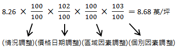
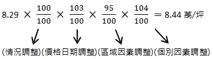
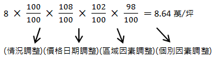
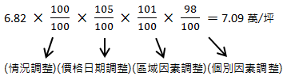
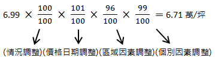
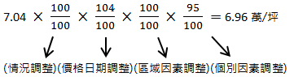

# 不動產估價實務模擬試題,許文昌老師

## 文章資訊
- 文章編號：412833
- 作者：許文昌
- 發布日期：2018/07/26
- 爬取時間：2025-02-02 13:53:08
- 原文連結：[閱讀原文](https://real-estate.get.com.tw/Columns/detail.aspx?no=412833)

## 內文
一、勘估標的為臨接30公尺寬道路之方整土地，土地面積500坪，使用分區為都市計畫住宅區，建蔽率50%，容積率150%，價格日期為107年7月1日，勘察日期為107年8月19日。請以下列所給的資料，在勘估標的移入容積20%之條件下，評估勘估標的之特定價格，並以不動產估價報告書呈現。
二、買賣實例資料：
(一)實例A：土地面積242坪，107年3月28日成交金額2,000萬元，都市計畫住宅區，建蔽率50%，容積率180%，位於勘估標的之近鄰地區，個別因素調整率103%，價格日期調整率102%。
(二)實例B：土地面積308坪，106年4月14日成交金額2,100萬元，都市計畫住宅區，建蔽率50%，容積率150%，位於勘估標的之類似地區，區域因素調整率101%，個別因素調整率98%，價格日期調整率105%。
(三)實例C：土地面積415坪，107年5月10日成交金額2,900萬元，都市計畫住宅區，建蔽率50%，容積率150%，位於勘估標的之類似地區，區域因素調整率96%，個別因素調整率99%，價格日期調整率101%。
(四)實例D：土地面積362坪，107年1月10日成交金額3,000萬元，都市計畫住宅區，建蔽率50%，容積率180%，位於勘估標的之類似地區，區域因素調整率95%，個別因素調整率104%，價格日期調整率103%。
(五)實例E：土地面積540坪，106年10月30日成交金額3,800萬元，都市計畫住宅區，建蔽率50%，容積率150%，位於勘估標的之近鄰地區，個別因素調整率95%，價格日期調整率104%。
(六)實例F：土地面積350坪，106年2月20日成交金額2,800萬元，都市計畫住宅區，建蔽率50%，容積率180%，位於勘估標的之類似地區，區域因素調整率102%，個別因素調整率98%，價格日期調整率108%。
三、土地開發分析法資料：
規劃興建地上三層或四層之透天住宅，無地下室，陽台以總樓地板面積之八分之一計，屋頂突出物以建築面積之八分之一計。平均售價每坪12萬元，營造施工費每坪5萬元。規劃設計費以營造施工費之2%計，廣告銷售費以總銷售金額之4%計，管理費以總銷售金額之3%計，稅捐及其他負擔以總銷售金額之1%計，適當利潤率以15%計。一年期定存利率0.8%，放款利率2.8%。土地投資之自有資金比例30%，借貸資金比率70%。建築投資之自有資金比例40%，借貸資金比率60%。土地價值比率55%，建物價值比率45%。土地開發年期2年(含建築開發年期1.5年)。
【建請同學先自行練習，再參考解答】
一、不動產估價報告書：
(一)委託人：○○○。
(二)勘估標的之基本資料：○○市（縣）○○區（鄉、鎮、市）○○段○○小段○○地號，土地面積500坪。
(三)價格日期及勘察日期：
價格日期：民國107年7月1日。
勘察日期：民國107年8月19日。
(三)價格種類：特定價格。
(四)估價條件：勘估標的移入容積20%之條件。
(五)估價目的：容積移轉接受基地之價格參考。
(六)估價金額：新臺幣肆仟貳佰伍拾伍萬元正。
(七)勘估標的之所有權、他項權利及其他負擔。
所有權人：○○○。
他項權利：○○○。
其他負擔：○○○。
(八)勘估標的使用現況：○○○。
(九)勘估標的法定使用管制及其他管制事項：
法定使用管制：住宅區，建蔽率50%，容積率150%。
其他管制事項：○○○。
二、價格形成主要因素分析：
(一)區域因素分析：
區域公共設施概況。
區域交通運輸概況。
區域生活機能概況。
區域不動產供需概況。
區域未來發展概況。
(二)個別因素分析：
勘估標的臨路情形。
勘估標的形狀。
勘估標的寬度。
勘估標的深度。
勘估標的分區管制。
三、估價所運用之方法與其估算過程及價格決定之理由：
(一)估價所運用之方法：
勘估標的特定價格：含容積移入之勘估標的價格以土地開發分析法評估為主，參酌比較法評估之。
勘估標的正常價格：未含容積移入之勘估標的價格以土地開發分析法評估為主，參酌比較法評估之。
(二)估算過程：
含容積移入之勘估標的特定價格估計：
比較法：
實例A：
2,000÷242=8.26萬／坪

實例D：
3,000÷362=8.29萬／坪

實例F：
2,800÷350=8萬／坪

綜上，考量實例A位於近鄰地區，且成交日期離價格日期最近，故賦予最高權重50%。實例D與實例F皆位於類似地區，但實例D之成交日期離價格日期較近，故賦予實例D之權重30%，賦予實例F之權重20%。最後，加權平均後得到比較價格每坪8.6萬元。
8.68×50%+8.44×30%+8.64×20%=8.6萬／坪
土地開發分析法：
銷售面積：
容積率原為150%，容積移入20%。
150%×(1+20%)=180%
建蔽率50%，容積率180%，興建地上四層透天住宅，無地下室。
500×180%=900坪（基準樓地板面積）
900×1/8=112.5坪（陽台面積）
500×50%×1/8=31.25坪（屋頂突出物面積）
900+112.5+31.25=1,044坪（銷售面積）
總銷售金額（S）：
12×1,044=12,528萬元
直接成本（C）：
5×1,044=5,220萬元
間接成本（M）：
規劃設計費：5,220×2%=104萬元
廣告銷售費：12,528×4%=501萬元
管理費：12,528×3%=376萬元
稅捐及其他負擔：12,528×1%=125萬元
合計：104+501+376+125=1,106萬元
綜合利率（i）：
(0.8%×30%+2.8%×70%)×2×55%+(0.8%×40%+2.8%×60%)×1.5×1/2×45%=3.095%
適當利潤率（R）：
適當利潤率以15%計。
土地開發分析價格（V）：
V=S÷(1+R)÷(1+i)-(C+M)
=12,528÷(1+15%)÷(1+3.095%)-(5,220+1,106)
=4,241萬元（總價）
4,241÷500=8.48萬／坪（單價）
含容積移入之勘估標的價格決定：本報告以比較法估得土地比較價格為8.6萬元／坪，以土地開發分析法估得土地開發分析價格為8.48萬元／坪。容積移轉接受基地估價以土地開發分析法為主，以比較法為輔，故賦予土地開發分析價格之權重60%，賦予比較價格之權重40%。最後，加權平均後得出含容積移入之勘估標的土地單價為8.51萬元／坪，總價為4,255萬元。
8.6×40%+8.48×60%=8.51萬／坪
8.51×500=4,255萬元
未含容積移入之勘估標的正常價格估計：
比較法：
實例B：
2,100÷308=6.82萬／坪

實例C：
2,900÷415=6.99萬／坪

實例E：
3,800÷540=7.04萬／坪

綜上，實例E雖位於近鄰地區，但成交日期離價格日期稍遠；實例C雖位於類似地區，但成交日期離價格日期最近，故實例C及實例E賦予相同權重，皆為40%。實例B位於類似地區，且成交日期離價格日期最遠，故賦予最低權重20%。最後，加權平均後得到比較價格每坪6.89萬元。
7.09×20%+6.71×40%+6.96×40%=6.89萬／坪
土地開發分析法：
銷售面積：
建蔽率50%，容積率150%，興建地上三層透天住宅，無地下室。
500×150%=750坪（基準樓地板面積）
750×1/8=93.75坪（陽台面積）
500×50%×1/8=31.25坪（屋頂突出物面積）
750+93.75+31.25=875坪（銷售面積）
總銷售金額（S）：
12×875=10,500萬元
直接成本（C）：
5×40%+7.11×60%=7.02萬／坪
7.02×500=3,510萬元875=4,375萬元
間接成本（M）：
規劃設計費：4,375×2%=88萬元
廣告銷售費：10,500×4%=420萬元
管理費：10,500×3%=315萬元
稅捐及其他負擔：10,500×1%=105萬元
合計：88+420+315+105=928萬元
綜合利率（i）：
(0.8%×30%+2.8%×70%)×2×55%+(0.8%×40%+2.8%×60%)×1.5×1/2×45%=3.095%
適當利潤率（R）：
適當利潤率以15%計。
土地開發分析價格（V）：
V=S÷(1+R)÷(1+i)-(C+M)
=10,500÷(1+15%)÷(1+3.095%)-(4,375+928)
=3,553萬元（總價）
3,553÷500=7.11萬／坪（單價）
未含容積移入之勘估標的價格決定：本報告以比較法估得土地比較價格為6.89萬元／坪，以土地開發分析法估得土地開發分析價格為7.11萬元／坪。容積移轉接受基地估價以土地開發分析法為主，以比較法為輔，故賦予土地開發分析價格之權重60%，賦予比較價格之權重40%。最後，加權平均後得出，未含容積移入之勘估標的土地單價為7.02萬元／坪，總價為3,510萬元。
6.89×40%+7.11×60%=7.02萬／坪
7.02×500=3,510萬元
(三)依不動產技術規則第6條第2項規定：「不動產估價，應註明其價格種類；其以特定價格估價者，應敘明其估價條件，並同時估計其正常價格。」因此，本報告評估結果如下：
含容積移入之勘估標的特定價格，土地單價為8.51萬元/坪，總價為4,255萬元。
未含容積移入之勘估標的正常價格，土地單價為7.02萬元/坪，總價為3,510萬元。
(四)其他與估價相關之必要事項及依規定須敘明事項：○○○。
(五)不動產估價師姓名及其證照字號：○○○。
四、附件：本報告書有關文件：
(一)勘估標的位置圖。
(二)勘估標的及其四鄰照片。
(三)土地登記簿謄本。
(四)地籍圖謄本。
(五)土地使用分區證明書。

---
*注：本文圖片存放於 ./images/ 目錄下*
