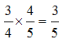
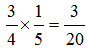
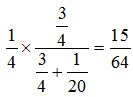
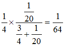

# 土地法第34條之1實例研習(四),許文昌老師

## 文章資訊
- 文章編號：413838
- 作者：許文昌
- 發布日期：2018/11/26
- 爬取時間：2025-02-02 13:53:28
- 原文連結：[閱讀原文](https://real-estate.get.com.tw/Columns/detail.aspx?no=413838)

## 內文
甲、乙二人共有一筆土地，甲之應有部分四分之三，乙之應有部分四分之一。嗣乙死亡，乙之應有部分由丙與丁二人繼承，丙之應繼分五分之四，丁之應繼分五分之一。
(一)甲未經乙同意將該地全部出售於戊，是否可行？如丙、丁二人均行使優先購買權，應如何處理？
(二)丙未經丁同意將應有部分四分之一出售於庚，是否可行？如甲、丁二人均行使優先購買權，應如何處理？
【解答】
(一)就共有土地全部而言:甲之應有部分四分之三，已超過三分之二，人數不予計算。故甲未經乙同意將該地全部出售於戊，為可行。此時，其他共有人丙、丁二人有優先購買權。如丙、丁二人均行使優先購買權，則按二人之潛在應有部分（即應繼分）定之。即丙優先購買五分之三，丁優先購買二十分之三。
丙：

丁：

(二)就應有部分四分之一而言:將應有部分四分之一視為一物，丙之潛在應有部分（即應繼分）五分之四，已超過三分之二，人數不予計算。故丙未經丁同意將應有部分四分之一出售於庚，為可行。此時，其他共有人甲、丁二人有優先購買權。如甲、丁二人均行使優先購買權，則按甲之應有部分與丁之潛在應有部分（即應繼分）之比率定之。即甲優先購買六十四分之十五，丁優先購買六十四分之一。
甲：

丁：

---
*注：本文圖片存放於 ./images/ 目錄下*
