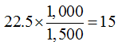

# 房地合一所得稅計算實例,許文昌老師

## 文章資訊
- 文章編號：417602
- 作者：許文昌
- 發布日期：2020/01/16
- 爬取時間：2025-02-02 13:54:34
- 原文連結：[閱讀原文](https://real-estate.get.com.tw/Columns/detail.aspx?no=417602)

## 內文
甲於民國106年5月以800萬元購入一間房地，設籍且自住連續滿6年，並於民國112年10月以1,500萬元售出，甲又於民國113年3月以1,000萬元購入一間房地，設籍且自住，則甲按自住優惠規定應繳納多少房地合一所得稅？甲申請重購退稅可退還多少稅額？
【解答】
(一)房地合一所得稅：
1,500-800-1,500x5%=625
625-400=225
225x10%=22.5
(二)重購退稅：

答：甲應繳納22.5萬元之房地合一所得稅，甲可以申請重購退稅15萬元。

---
*注：本文圖片存放於 ./images/ 目錄下*
