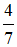
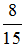

# 土地法第34條之1實例研習(二),許文昌老師

## 文章資訊
- 文章編號：420269
- 作者：許文昌
- 發布日期：2020/11/12
- 爬取時間：2025-02-02 13:55:37
- 原文連結：[閱讀原文](https://real-estate.get.com.tw/Columns/detail.aspx?no=420269)

## 內文
甲、乙、丙三人共有一筆土地，應有部分各三分之一。之後，丙死亡，由A、B、C、D、E五人公同共有繼承，應繼分各五分之一。今，甲、A、B、C四人同意出售該地於丁，但乙、D、E三人反對，則出售是否可行？
【解答】
土地法第34條之1第1項規定：「共有土地或建築改良物，其處分、變更及設定地上權、農育權、不動產役權或典權，應以共有人過半數及其應有部分合計過半數之同意行之。但其應有部分合計逾三分之二者，其人數不予計算。」又，土地法第三十四條之一執行要點第6點第3項規定：「分別共有與公同共有併存之土地或建物，部分公同共有人已得依本法條規定處分其公同共有之應有部分，且另有分別共有之共有人同意處分全部共有物者，於計算本法條第一項共有人數及其應有部分時，該公同共有部分，以同意處分之人數及其潛在應有部分併入計算。」準此，甲、A、B、C四人同意，但乙、D、E三人反對，同意之共有人數為

，已逾半數，且同意之應有部分與潛在應有部分（指應繼分）為

，已逾半數，故出售可行。

---
*注：本文圖片存放於 ./images/ 目錄下*
