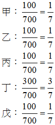

# 共有土地之分割與合併（下）,許文昌老師

## 文章資訊
- 文章編號：420996
- 作者：許文昌
- 發布日期：2021/01/21
- 爬取時間：2025-02-02 13:55:52
- 原文連結：[閱讀原文](https://real-estate.get.com.tw/Columns/detail.aspx?no=420996)

## 內文
(三)土地法第34條之1多數決：
共有土地分割：茲分標示分割與權利分割分別說明：
標示分割：標示分割屬於土地法第34條之1第1項所稱「變更」，故標示分割得適用土地法第34條之1多數決。
權利分割：權利分割雖屬處分行為，惟多數人代理少數人決定分割後所分配之土地位置，難謂公平合理；況共有土地無法協議分割，尚得聲請法院裁判分割。因此，權利分割不得適用土地法第34條之1多數決。
共有土地合併：土地法第三十四條之一執行要點第5點第1項規定：「共有土地或建物標示之分割、合併、界址調整及調整地形，有本法條之適用。」準此，共有土地之合併得適用土地法第34條之1多數決
二宗以上所有權人不相同之共有土地或建物，依土地法第34條之1規定申請合併，應由各宗土地或建物之共有人分別依土地法第34條之1規定辦理（土地法第三十四條之一執行要點第5點第2項）。又，申請合併之共有土地地價不一者，合併後各共有人之權利範圍，應以合併前各共有人所有土地之地價與各宗土地總地價之和之比計算，並不得影響原設定之他項權利（土地法第三十四條之一執行要點第8點第7款）。如甲、乙、丙三人共有一筆A地，應有部分各三分之一，A地公告土地現值300萬元，丁、戊二人共有一筆B地，丁之應有部分四分之三，戊之應有部分四分之一，B地公告土地現值400萬元。今擬將A地與B地合併為一筆C地，甲、乙、丁三人同意，丙、戊二人反對，則A地之同意共有人數超過二分之一，應有部分超過二分之一，符合土地法第34條之1第1項多數決門檻；B地之同意共有人應有部分超過三分之二，人數不計算，亦符合土地法第34條之1第1項多數決門檻。因此，A地與B地之合併得適用土地法第34條之1多數決。合併後之C地應有部分如下：

上例之合併，依土地稅法施行細則第42條第4項規定，不徵土地增值稅。
總之，共有土地合併，不論標示合併或權利合併，皆得適用土地法第34條之1多數決。惟合併後各共有人之權利範圍，應以合併前各共有人所有土地之地價與各宗土地總地價之和之比計算。

---
*注：本文圖片存放於 ./images/ 目錄下*
