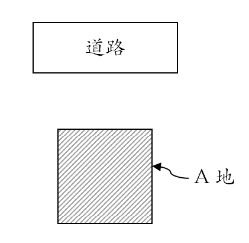
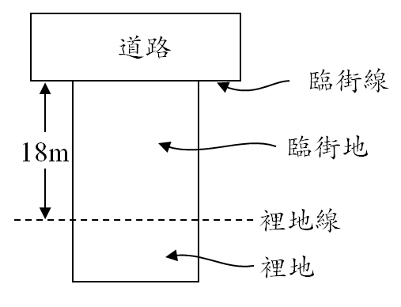

# 袋地與裡地,許文昌老師

## 文章資訊
- 文章編號：904741
- 作者：許文昌
- 發布日期：2022/06/30
- 關鍵詞：袋地、裡地
- 爬取時間：2025-02-01 23:23:30
- 原文連結：[閱讀原文](https://real-estate.get.com.tw/Columns/detail.aspx?no=904741)

## 內文

(一)	袋地之意義：

袋地，指不直接臨路之土地。如圖1所示，A地為袋地。民法第787條至789條有關袋地通行權之規定，是為著例。

圖1　袋地

(二)	裡地之意義：

裡地，指我國繁榮街道路線價區段，以裡袋（距離臨街線18公尺）劃分為臨街地與裡地，如圖2所示。臨街地採路線價估價法，裡地採區段價法。

圖2　裡地

(三)	兩者比較：
袋地，係地界實際狀況。裡地，係因估價而設。
袋地，乃實際地界不直接臨路。裡地，乃實際地界直接臨路，但為了估價，人為劃出裡地線，在裡地線以外之土地皆為裡地。
袋地，凡不直接臨路皆屬之，而不問距離道路多遠。裡地，須距離道路18公尺以上之土地始屬之；但18公尺以下之土地，非屬裡地。
袋地，適用民法有關袋地通行權之規定。裡地，不適用民法有關袋地通行權之規定。

---
*注：本文圖片存放於 ./images/ 目錄下*
