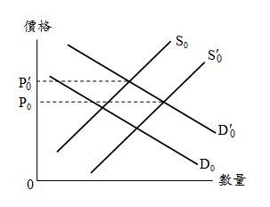
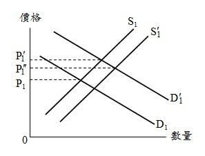
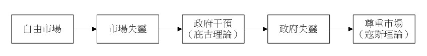

# 市場失靈與政府失靈,許文昌老師

## 文章資訊
- 文章編號：907167
- 作者：許文昌
- 發布日期：2023/03/02
- 關鍵詞：市場失靈、政府失靈
- 爬取時間：2025-02-01 23:22:06
- 原文連結：[閱讀原文](https://real-estate.get.com.tw/Columns/detail.aspx?no=907167)

## 內文

(一)	市場失靈
意義：土地市場運行中，無法藉由市場機制與價格機能，解決問題的地方。茲說明市場運行與市場失靈之關係：

(1)無市場失靈現象：一般財貨（如蘋果、電視機等）市場，如圖(一)所示，一般財貨之需求曲線D0與一般財貨之供給曲線S0，二者交點決定一般財貨價格P0。今，因所得提高，對一般財貨之需求增加，需求曲線由D0右上移至 ，價格由P0上漲至 。供給者發現價格上漲，有利可圖，因而增加一般財貨生產及進口，致供給曲線由S0右下移至 ，價格再由 下跌至P0水準。由此可知，市場機制與價格機能有效運作，價格回復至原來水準，無市場失靈現象。

圖(一)　一般財貨之市場運行
(2)有市場失靈現象：土地市場，如圖(二)所示，土地需求曲線D1與土地供給曲線S1，二者交點決定土地價格P1。今，因所得提高，對土地之需求增加，需求曲線由D1右上移至 ，價格由P1上漲至 。供給者發現價格上漲，有利可圖，惟土地不能生產，亦不能進口，因而供給增加有限，致供給曲線由S0右下移至 ，價格再由 下跌至 。由此可知，市場機制與價格機能無法有效運作，價格無法回復至原來水準，發生市場失靈現象。

圖(二)　土地之市場運行
原因：

(1)外部性：土地利用或土地開發時，如果存在外部成本或外部利益，將使私人決策之均衡點與社會決策之均衡點不一致，而導致市場失靈。

(2)公共財：公共財在需求上具有「非敵對性」，在供給上具有「無排他性」。如由市場自由運作，將發生搭便車現象，造成供給不足，而導致市場失靈。

(3)獨占性：土地具有異質性，彰顯其獨占地位。如由市場自由運作，將發生釘子地或釘子戶問題，而導致市場失靈。

(4)稀少性：土地無法製造，供給量有限，供給彈性甚小。如由市場自由運作，將發生需強供弱現象，而導致市場失靈。

(5)資訊不全：土地無集中市場，資訊不充分與不流通。基於囚犯困境原理，私人之最佳決策，並非總體之最佳決策。
舉例：房價及地價高漲，即是市場失靈之現象。房價及地價高漲，炒作土地及房屋有暴利可圖，投機需求猖獗，房價及地價更上漲。此時，唯賴政府及時干預（如實施打擊房地投機措施），始克平息。

(二)	政府失靈
意義：市場失靈提供政府干預的理由，然而政府並非萬能，其干預效果仍然有限，甚至適得其反。
原因：

(1)欠缺利潤誘因：政府之公務員領取固定薪酬，而無獎金與盈餘分配制度，因循苟且心態，造成政府施政效率不彰。

(2)缺乏競爭：政府機關為獨占事業，所辦理業務（如地政業務、戶政業務等）皆無其他競爭者。有競爭，才會不斷檢討改進，才會不斷進步成長。

(3)博採眾議：政府決策，受到議會監督。因此民意代表、利益團體等運用其影響力左右決策，造成最後決策並非最佳決策，而是相互妥協之結果。

(4)官僚體系：政府機關運作，涉及縱的指揮系統及橫的協調系統。不論指揮與協調均存在單位與單位之間的節點，以致執行成效七折八扣。

(5)貪污舞弊：不肖公務員假借公權力，貪污舞弊，追求個人財富最大化，而造成決策錯誤。
舉例：房價及地價高漲，政府擬採取打擊房地投機措施。然一般政策之實施，可能產生時間落後之現象。此現象依序為：認知落後、行政落後、決策落後、執行落後與效驗落後等五種。認知落後乃是問題存在直至被發覺這段時間。行政落後乃是政府當局發覺問題存在，從事蒐集有關資訊、分析原因及擬訂對策這段時間。決策落後乃是政府機關將擬訂對策提出立法或議會機關通過這段時間。執行落後乃是決策通過後至交付有關單位執行這段時間。效驗落後乃是決策執行至預期效果產生這段時間。在房地產過熱時應立即採取打擊房地投機措施加以抑制，然由於政策的時間落後，實施時房地產已走入蕭條，蕭條期之打擊房地投機措施將使房地產更加蕭條。

(三)結論
因市場失靈，而需要政府干預。因政府干預，而產生政府失靈。
庇古（Pigou）理論主張政府干預；寇斯（Coase）理論主張尊重市場。

---
*注：本文圖片存放於 ./images/ 目錄下*
