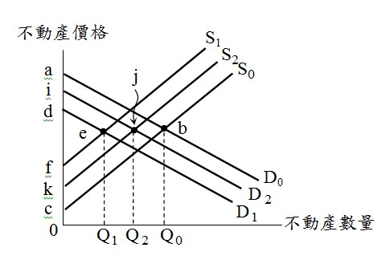

# 交易成本,許文昌老師

## 文章資訊
- 文章編號：907535
- 作者：許文昌
- 發布日期：2023/04/06
- 關鍵詞：交易成本、Transaction Cos、不動產交易、財貨交易
- 爬取時間：2025-02-01 23:21:53
- 原文連結：[閱讀原文](https://real-estate.get.com.tw/Columns/detail.aspx?no=907535)

## 內文

(一)	交易成本之意義

交易成本（ Transaction Cost ），指交易過程中所必須負擔之成本。以買賣為例，買方必須負擔交易成本，賣方亦須負擔交易成本。

交易成本有別於生產成本。前者係因交易而產生，後者係因生產而產生。

(二)	交易成本之內容
搜尋資訊之成本：買方擬購買不動產，必須蒐集資訊，以避免買貴。同理，賣方擬出售不動產，必須蒐集資訊，以避免賤售。因此，買賣雙方均有蒐集資訊之成本。
雙方議價尋求真實價格之成本：買賣雙方討價還價，最後達成一致價格。因此，買賣雙方均有協商議價之成本。
訂定契約之成本：買賣雙方簽訂契約，必須對契約內容逐條審視，以避免契約內容不利於己，而造成交易風險。因此，買賣雙方均有簽訂契約之成本。
監視與執行契約之成本：買賣雙方依契約規定行使權利及履行義務。買方監視對方，是否如期辦理過戶登記；賣方監視對方，是否如期交付款項。因此，買賣雙方均有監視對方履行之成本。
保護財產權排除他人侵權之成本：契約履行結果，買方取得不動產，賣方取得價金。如有一方違約，另一方行使請求權，訴請法院強制執行。因此，雙方均有保護財產權排除他人侵權之成本。

(三)	不動產交易成本偏高

不動產交易與其他財貨交易一樣，均存在交易成本。然，不動產交易成本偏高，其理由如下：
不動產具有異質性：每一件不動產都不一樣，因此買方購買不動產必須精挑細選，並赴現場看屋。
不動產無集中市場：股票有集中市場，故其交易成本低。不動產無集中市場，故其交易成本高。
不動產資訊不流通：不動產交易資訊較其他財貨封閉。不動產交易資訊不流通、不正確及不對稱，造成不動產交易成本高。
不動產交易金額大：不動產屬於高價財貨，買賣交易須特別謹慎，稍有不慎，將損失慘重。因此，不動產交易之議價時間長，預防措施多，故不動產交易成本高。
不動產過戶手續繁瑣：不動產交易必須辦理移轉登記。過戶手續繁複、時間拉長、風險增高，造成不動產交易成本高。

(四)交易成本對不動產市場之影響

如圖所示，D
0
代表無交易成本之不動產需求曲線，S
0
代表無交易成本之不動產供給曲線。由D
0
與S
0
之交點b，決定不動產交易數量Q
0
。當不動產買賣存在交易成本，因買方有交易成本而使D
0
左下移至D
1
，因賣方有交易成本而使S
0
左上移至S
1
。由D
1
與S
1
之交點e，決定不動產交易數量Q
1
。不動產買賣因存在交易成本，不動產交易量由Q
0
減少至Q
1
，社會福利由△abc縮小為△def。

(五)實價登錄與新科技應用對交易成本之影響
實價登錄：政府推行實價登錄，不動產交易資訊更充分、更透明、更正確，減少買賣雙方搜尋資訊之成本，因而降低交易成本。如圖所示，D
1
代表實價登錄實施前之不動產需求曲線，S
1
代表實價登錄實施前之不動產供給曲線。由D
1
與S
1
之交點e，決定不動產交易量Q
1
。嗣實價登錄推行，買方之交易成本降低，而使D
1
右上移至D
2
，賣方之交易成本降低而使S
1
右下移至S
2
。由D
2
與S
2
之交點j，決定不動產交易量Q
2
。實價登錄推行，不動產交易量由Q
1
增加至Q
2
，社會福利由△def擴大為△ijk。

最有效率資源配置之交易量在Q
0
。因不動產買賣存在交易成本，而使資源配置之交易量Q
1
遠離最有效率資源配置之交易量Q
0
。實價登錄實施，降低交易成本，而使資源配置之交易量由Q
1
增加至Q
2
，更趨近最有效率資源配置交易量Q
0
。
新科技應用：新科技應用可以降低交易成本。如買方可以先透過網路3D看屋，初步滿意後，才赴現場實地勘查，以減少不必要看屋之交易成本。展望未來，3D看屋進化至虛擬實境看屋，更可大幅度降低交易成本。

(六)	結論
交易成本等於零，資源配置最有效率。沒有交易成本的世界，稱為「寇斯（Coase）的世界」。寇斯定理是建立在交易成本為零之理想境界。但現實社會，交易成本無所不在，因此，無法達成資源最有效率之配置。
交易成本愈大，資源配置效率愈低。因此，如何降低交易成本，而且交易成本愈低愈好，俾往最有效率資源配置邁進。
政府建立制度（如實價登錄、履約保證、定型化契約等），可以有效降低交易成本，增進市場效率。

---
*注：本文圖片存放於 ./images/ 目錄下*
