# 屠能（Thünen）模與辛克萊（Sinclair）模式,許文昌老師

## 文章資訊
- 文章編號：908628
- 作者：許文昌
- 發布日期：2023/07/27
- 關鍵詞：屠能、辛克萊、都市發展、經濟作物、農地
- 爬取時間：2025-02-01 23:21:20
- 原文連結：[閱讀原文](https://real-estate.get.com.tw/Columns/detail.aspx?no=908628)

## 內文

(一)	屠能模式：如圖(一)所示，0代表都市，

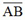

代表經濟作物之競租線，

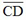

代表穀類作物之競租線，

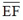

代表根莖作物之競租線。經過競標地租之結果，0～t
0
種植經濟作物，t
0
～t
1
種植穀類作物，t
1
～t
2
種植根莖作物。屠能理論認為，農地利用離都市愈近，愈集約利用；離都市愈遠，愈粗放利用。

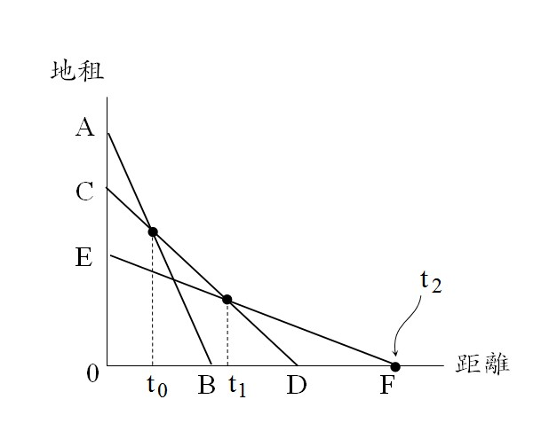

圖(一)　屠能模式

(二)	辛克萊模式：都市規模不斷擴張，都市邊緣之農地，農民期待轉用及隨時準備拋售土地之心理下，多不願投入大量勞力資本進行農業經營，因此土地利用趨於粗放。亦即，距離都市愈近土地，愈有可能轉用，因而農地利用愈粗放。是以，離都市愈近，愈粗放利用；離都市愈遠，愈集約利用。此種反常現象，直到都市發展潛力終止點，農地在短期之內不可能轉變為都市土地，才又向外回到屠能模式。如圖(二)所示，

及
代表經濟作物之競租線，

及
代表穀類作物之競租線，

及
代表根莖作物之競租線。0為都市，0～

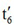

為農業土地。

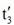

為都市發展潛力之終止點。因此，0～

為受都市發展影響之都市周邊農地，

～

為未受都市發展影響之一般農地。
受都市發展影響之都市周邊農地：經過競標地租之結果，0～

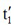

種植根莖作物，

～

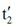

種植穀類作物，

～

種植經濟作物。因此，離都市愈近，愈粗放利用；離都市愈遠，愈集約利用。此即辛克萊模式。

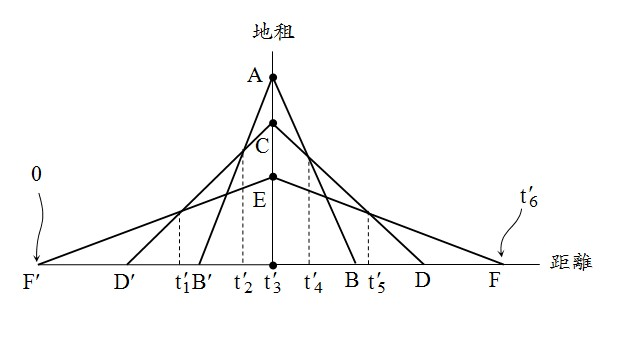

圖(二)　辛克萊模式

未受都市發展影響之一般農地：經過競標地租之結果，

～

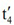

種植經濟作物，

～

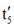

種植穀類作物，

～

種植根莖作物。因此，離都市愈近，愈集約利用；離都市愈遠，愈粗放利用。此即屠能模式。

(三)	結論：
屠能模式係描述一般農地在無投機因素下之正常農地使用配置。辛克萊模式係描述都市周邊農地在有投機因素下之反常農地使用配置。
屠能模式在說明離都市愈近，愈集約利用；離都市愈遠，愈粗放利用。辛克萊模式在說明離都市愈近，愈粗放利用；離都市愈遠，愈集約利用。

---
*注：本文圖片存放於 ./images/ 目錄下*
