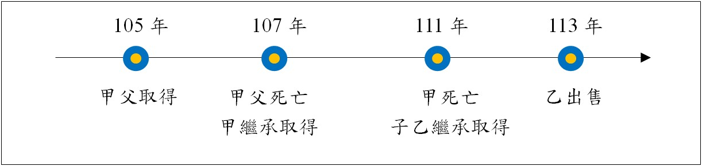

# 房地合一稅有關放寬連續繼承之持有期間認定：台財稅字第11204619060號,曾榮耀老師

## 文章資訊
- 文章編號：909546
- 作者：蘇偉強
- 發布日期：2023/11/07
- 關鍵詞：繼承人、連續繼承、遺贈
- 爬取時間：2025-02-01 23:20:49
- 原文連結：[閱讀原文](https://real-estate.get.com.tw/Columns/detail.aspx?no=909546)

## 內文

各位同學好

有關房地合一稅有最新的財政部函釋，針對以往連續繼承之持有期間認定爭議部分，有所放寬，屬於重要觀念，茲說明如下：

請先對照我們之前講過的一期專欄，就有提到這個爭議，後來經法院判決認定只能加計前一次不可以累計：

連續多次繼承之房地合一稅課徵認定：臺中高等行政法院110訴字第161號判決,曾榮耀老師,許文昌/曾榮耀不動產全制霸專欄,高點來勝不動產 (get.com.tw)

然而，此次函釋等同放寬可不斷加計到第一次繼承前之被繼承人持有期間。

函釋內容：

一、個人交易105年1月1日以後繼承或受遺贈取得之房屋、土地（以下簡稱房地），依所得稅法第14條之4第4項規定，計算同條第3項各款持有期間及同法第4條之5第1項第1款第1目及第2目期間時，
如屬連續繼承或受遺贈取得之房地，得將連續各次繼承或受遺贈之被繼承人或遺贈人持有期間合併計算。
但經稽徵機關查明有藉法律形式規避或減少納稅義務之安排或情事者，不適用之。

二、前點所稱連續繼承或受遺贈取得之房地，指該房地連續發生2次以上（含當次）繼承或受遺贈而移轉所有權之情形。

三、第1點個人計算所得稅法第4條之5第1項第1款第1目及第2目期間時，
得併計之期間，以同點規定各次被繼承人、遺贈人或其配偶、未成年子女已於該房屋辦竣戶籍登記並居住，且無出租、供營業或執行業務使用之期間為限
。

舉例：

由於甲繼承後未出售，而後直接再次由乙繼承（連續繼承）

乙繼承取得至出售之持有期間＝111～113年＝2年

得合併計算乙之被繼承人甲之持有期間＝107～111年＝4年

得再合併計算甲之被繼承人父之持有期間＝105～107年＝2年

以上合併計算共計8年，適用稅率為20%。

另外，要適用自住房、地優惠的話，則這幾段需都符合規定之設戶籍、無出租營業等條件，可合併計算時間。

參考資料：財政部，112年11月2日，台財稅字第11204619060號，

https://gazette2.nat.gov.tw/EG_FileManager/
eguploadpub/eg029207/ch04/type2/gov30/
num7/Eg.htm

---
*注：本文圖片存放於 ./images/ 目錄下*
