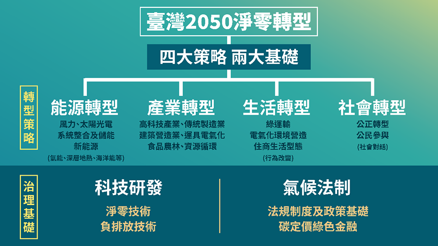
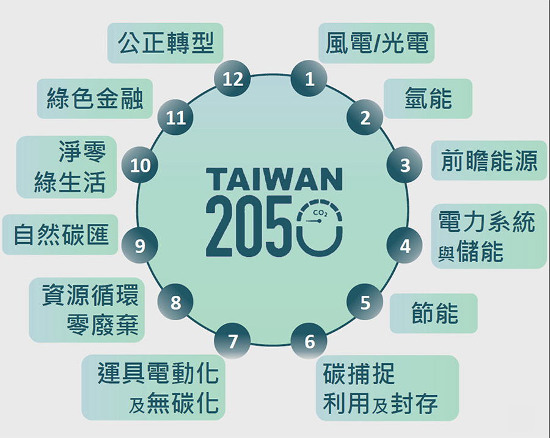

# 淨零排放之意義與土地利用規劃作為,曾榮耀老師

## 文章資訊
- 文章編號：910921
- 作者：蘇偉強
- 發布日期：2024/04/02
- 關鍵詞：淨零排放、溫室氣體、碳匯
- 爬取時間：2025-02-01 23:20:05
- 原文連結：[閱讀原文](https://real-estate.get.com.tw/Columns/detail.aspx?no=910921)

## 內文

(一)意義
淨零排放：指溫室氣體排放量與碳匯量達成平衡。
國家溫室氣體長期減量目標為中華民國一百三十九年（2050）溫室氣體淨零排放。為達成前項目標，各級政府應與國民、事業、團體共同推動溫室氣體減量、發展負排放技術及促進國際合作。(氣候變遷因應法第4條)

(二)路徑

我國於2022年3月正式公布「臺灣2050淨零排放路徑及策略總說明」，提供至2050年淨零之軌跡與行動路徑，以促進關鍵領域之技術、研究與創新，引導產業綠色轉型，帶動新一波經濟成長，並期盼在不同關鍵里程碑下，促進綠色融資與增加投資，確保公平與銜接過渡時期。

我國2050淨零排放路徑將會以「能源轉型」、「產業轉型」、「生活轉型」、「社會轉型」等四大轉型，及「科技研發」、「氣候法制」兩大治理基礎，輔以「十二項關鍵戰略」，就能源、產業、生活轉型政策預期增長的重要領域制定行動計畫，落實淨零轉型目標。

(三)碳匯
意義

碳匯指將二氧化碳或其他溫室氣體自排放源或大氣中持續移除後，吸收或儲存之樹木、森林、土壤、海洋、地層、設施或場所。
類型 (1)綠碳（森林碳匯）

(2)藍碳（海洋碳匯）

(3)黃碳（土壤碳匯）

(四)土地利用規劃之作為

I.土地使用面向
降低不必要土地開發：在人口總量減少的變遷下，透過國土計畫減少不必要之土地開發，降低碳排放與節約能源。
增加碳匯空間：就國土計畫所劃設的國土保育地區加強保育，於國土復育促進地區進行生態復育，配合森林保育與造林，增加碳匯空間，藉此達到碳中和。
緊密都市（Compact city）規劃：藉由土地混合使用，將食衣住行育樂等日常生活所需之活動空間，盡可能配置在同一區域，可有效降低都市活動移動距離，以步行或自行車取代私人汽機車運具使用，減少不必要的交通旅次，進而縮減使用運具所產生的溫室氣體排放。

II.交通運輸面向
大眾運輸導向發展（Transit-oriented development, TOD）：係藉由大眾運輸系統之構建，引導居住、工作、購物、休閒等活動空間於大眾運輸路線廊帶上有秩序地分布，以形塑高可居性、可及性及有效率的永續都市型態與土地利用模式。藉此，提高大眾運輸使用率，降低碳排高的汽機車使用。
適當縮減停車位與道路用地劃設：適當縮減停車位與道路用地，以誘導搭乘大眾運輸，減少私人運具使用，進而減少碳排放。
打造友善綠色運輸環境：以人為本的交通規劃，確保自行車道、步行環境的友善性、可及性、安全性、連貫性等，藉此鼓勵多以步行、自行車等綠色運輸取代私人運具之通勤使用，減少碳排。

III.公共設施面向
公共設施區位規劃：就鄰里人口分布狀況，有效配置公共設施服務，減少通勤旅次。
既有公共設施再利用：由於少子化、高齡化之社會結構變遷，就閒置的學校等公共設施，規劃、清理轉型為社會住宅、安養中心等，避免重新開發增加碳排。

IV.都市設計面向
鼓勵綠建築：綠建築係在建築生命週期中，消耗最少地球資源，使用最少能源及製造最少廢棄物的建築物。因此，可於建築或開發審議時，除給予容積獎勵外，多鼓勵建商採用綠建築。
配置都市藍、綠帶系統與風廊：人口與建成環境集中下，都市熱島效應越趨嚴重。可透過水環境之藍帶系統，以及綠地、濕地之綠帶系統規劃設計，並配合風廊營造，紓緩熱島效應下冷氣空調大幅使用所造成之溫室氣體排放與高耗能。

---
*注：本文圖片存放於 ./images/ 目錄下*
