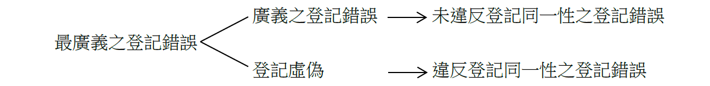
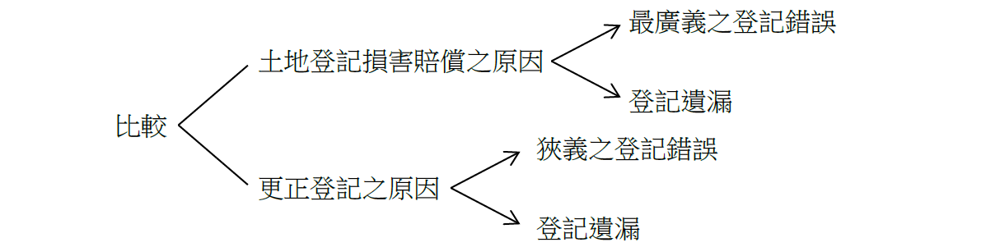

# 登記錯誤、登記遺漏及登記虛偽之闡述,許文昌老師

## 文章資訊
- 文章編號：910960
- 作者：許文昌
- 發布日期：2024/04/04
- 關鍵詞：土地登記、登記錯誤、登記遺漏、登記虛偽
- 爬取時間：2025-02-01 23:20:03
- 原文連結：[閱讀原文](https://real-estate.get.com.tw/Columns/detail.aspx?no=910960)

## 內文

土地法第68條第1項規定：「因登記錯誤遺漏或虛偽致受損害者，由該地政機關負損害賠償責任。但該地政機關證明其原因應歸責於受害人時，不在此限。」又，土地法第69條規定：「登記人員或利害關係人，於登記完畢後，發見登記錯誤或遺漏時，非以書面聲請該管上級機關查明核准後，不得更正。但登記錯誤或遺漏，純屬登記人員記載時之疏忽，並有原始登記原因證明文件可稽者，由登記機關逕行更正之。」準此，土地登記損害賠償之原因有三：①登記錯誤；②登記遺漏；③登記虛偽。另，更正登記之原因有二：①登記錯誤；②登記遺漏。換言之，土地登記損害賠償之原因有「登記虛偽」，更正登記之原因無「登記虛偽」

(一)登記錯誤之意涵：登記錯誤可分為最廣義之登記錯誤、廣義之登記錯誤及狹義之登記錯誤。
最廣義之登記錯誤：凡登記事項與真實情形不符者，均屬之。
廣義之登記錯誤：指未違反登記同一性之登記錯誤。所稱登記同一性，指土地登記之同一權利主體、同一權利種類、同一權利範圍及同一權利標的而言。
狹義之登記錯誤：指未違反登記同一性之登記錯誤，且登記事項與登記原因證明文件不符。

(二)登記虛偽之意涵：指違反登記同一性之登記錯誤。最廣義登記錯誤包括廣義之登記錯誤及登記虛偽二項。

(三)結論：
土地法第68條（土地登記損害賠償）之登記錯誤，指廣義之登記錯誤。土地法第69條（更正登記）之登記錯誤，指狹義之登記錯誤。
土地法第68條所定登記錯誤（指廣義之登記錯誤）與登記虛偽，二者結合而為最廣義之登記錯誤。準此，土地登記損害賠償之原因有二：

(1)最廣義之登記錯誤：指登記事項與真實情形不符者。

(2)登記遺漏：指應登記事項而漏未登記者。
土地法第69條所定登記錯誤，指狹義之登記錯誤。準此，更正登記之原因有二：

(1)狹義之登記錯誤：指未違反登記同一性之登記錯誤，且登記事項與登記原因證明文件所載之內容不符者。

(2)登記遺漏：指應登記事項而漏未登記者。

土地登記規則第13條所定義之登記錯誤（即登記事項與登記原因證明文件所載之內容不符），實際上僅適用於土地法第69條之更正登記。土地法第68條之土地登記損害賠償，不以此定義為限。

---
*注：本文圖片存放於 ./images/ 目錄下*
