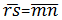
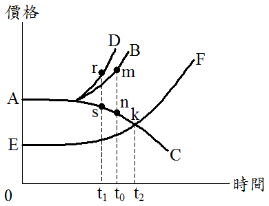

# 老舊建物拆除重建之時機,許文昌老師

## 文章資訊
- 文章編號：409213
- 作者：許文昌
- 發布日期：2017/02/09
- 爬取時間：2025-02-02 17:58:11
- 原文連結：[閱讀原文](https://real-estate.get.com.tw/Columns/detail.aspx?no=409213)

## 內文
建物使用一段時間後，通常會發生老舊衰頹而遭到拆除重建，試問拆除重建或土地再開發之時機如何決定？如圖所示，AB代表潛在房地總價(指土地在最有效使用下所規劃興建建物之房地總價)，AC代表實際房地總價(指目前實際建物之房地總價)。
當建物興建完成初期，土地上之建物符合當時之最有效使用，潛在房地總價等於實際房地總價，故無間隙現象。隨著時間之增加，一方面都市逐漸成長與擴張，造成潛在房地總價不斷上升；另一方面，原有建物逐漸老舊，造成實際房地總價不斷下降。因此，潛在房地總價與實際房地總價之間隙產生，並逐漸拉大。
當間隙拉大至足以涵蓋興建新建物之營建成本(假設為

)，則老舊建物就值得拆除重建。如圖所示，當建物使用至t
0
時，就值得拆除重建。又，當政府推行容積獎勵或容積移轉時，將使潛在房地總價由AB上移至AD，設(假設為

，則老舊建物拆除重建時機提前至t
1
進行。

如圖所示，EF代表素地價格(指不考慮建物對土地之影響，單就土地在最有效使用下之地價)。當素地價格等於實際房地總價，如圖中之K點，則老舊建物已無存在價值，應該立即拆除重建。總之，當建物使用至t
0
時，就「值得」拆除重建；當建物使用至t
2
時，就「應該」拆除重建。
此外，值得一提的是，從事房地估價時，在K點之前，評估房地價格，即評估實際房地總價AK；在K點之後，評估土地價格，即評估素地價格KF。

---
*注：本文圖片存放於 ./images/ 目錄下*
