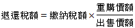

# 土地增值稅重購退稅額度與房地合一所得稅重購退稅額度之比較,許文昌老師

## 文章資訊
- 文章編號：410371
- 作者：許文昌
- 發布日期：2017/11/30
- 爬取時間：2025-02-02 18:02:09
- 原文連結：[閱讀原文](https://real-estate.get.com.tw/Columns/detail.aspx?no=410371)

## 內文
(一)土地增值稅之重購退稅額度如下：
新購土地地價＞(原出售土地地價—土地增值稅)：退還不足支付新購土地地價，但以已納土地增值稅為限。
新購土地地價≦(原出售土地地價—土地增值稅)：不得退稅。
(二)房地合一所得稅之重購退稅額度如下：
重購價額≧出售價額：退還全部稅額。
重購價額＜出售價額：按下列公式計算，退還部分稅額。

(三)比較：
土地增值稅重購退稅之適用對象包括自用住宅用地、自營工廠用地及自耕農業用地等三種。房地合一所得稅重購退稅之適用對象限於自住房地。
土地增值稅之重購退稅以土地價格計算，房地合一所得稅之重購退稅以房地價格計算。
土地增值稅重購退稅之計算，以該次移轉時之土地申報移轉現值為準。房地合一所得稅重購退稅之計算，以交易時之成交價格為準。
土地增值稅之重購價格過低，不得退稅。房地合一所得稅之重購價格不論高或低，皆可退稅。
土地增值稅按重購價格與原出售價格之「差額」予以退稅；但原出售價格須再扣除已繳之土地增值稅。房地合一所得稅按重購價額與原出售價額之「比率」予以退稅；但原出售價格不必再扣除已繳之房地合一所得稅。

---
*注：本文圖片存放於 ./images/ 目錄下*
