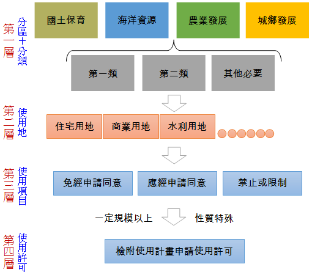

# 國土計畫土地使用管制架構,曾榮耀老師

## 文章資訊
- 文章編號：410479
- 作者：曾榮耀
- 發布日期：2014/12/14
- 爬取時間：2025-02-02 18:02:29
- 原文連結：[閱讀原文](https://real-estate.get.com.tw/Columns/detail.aspx?no=410479)

## 內文
各位同學好
地方特考剛考完，各位考生們辛苦了，也先預祝各位金榜題名！
今日專欄則針對國土計畫未來將於111年5月1日公告施行，正式取代區域計畫。因而國土計畫將是未來考試的趨勢，雖然許多子法仍在研訂當中，但基本上國土計畫的整體架構是必須先搞清楚的（例如今年經紀人考的是區域計畫的非都市土地使用管制架構）。國土計畫的土地使用管制架構主要分為四層管制，茲幫各位繪製架構圖如下，供各位理解：

---
*注：本文圖片存放於 ./images/ 目錄下*
