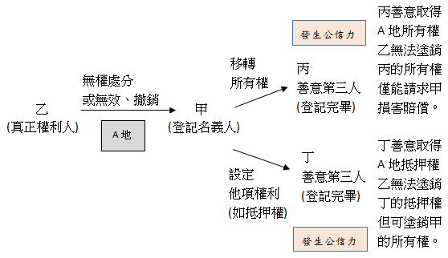

# 公信力（107地政士考題補充）,曾榮耀老師

## 文章資訊
- 文章編號：412414
- 作者：蘇偉強
- 發布日期：2018/06/14
- 爬取時間：2025-02-02 18:08:54
- 原文連結：[閱讀原文](https://real-estate.get.com.tw/Columns/detail.aspx?no=412414)

## 內文
各位同學好
本日專欄再針對本次地政士土地法規考題，作一些補充。實際上，該題是從一個68年的民事庭決議而來，如下，請同學參考。
而這邊幫同學整理一下整體概念：

土地法規第一題：我國土地法地籍編及民法物權編相關規定，不動產物權登記係採登記生效主義，非經依法登記不生效力。試問某甲擅將某乙所有土地移轉登記於甲自己名下所有，並設定抵押權登記給善意之某丙，則某乙能否訴請塗銷某甲之所有權移轉登記及某丙之抵押權登記？
根據最高法院68年度第5次民事庭庭推總會議決議（一）
民國68年04月17日
甲私擅將乙所有土地移轉登記於己，並已為善意之丙設定抵押權登記，甲之移轉登記如有無效之原因，即非信賴登記而取得新登記之善意第三人，不受土地法第四十三條之保護，縱令丙之抵押權登記應受同條之保護，乙仍可訴請塗銷甲之所有權移轉登記，而丙之抵押權即存在於乙之所有土地。
有甲、乙二說：
【討論意見】
【甲說】
甲私擅將乙所有土地移轉登記於自己，如有無效之原因，即非信賴登記而取得新登記之善意第三人，不受土地法第四十三條之保護，縱令丙之抵押權登記應受同條之保護，乙仍可訴請塗銷甲之所有權移轉登記。結果丙之抵押權即存在於乙之所有土地。
【乙說】
丙因信賴甲所有權之登記而為抵押權之新登記，既受土地法第四十三條之保護，不得塗銷，則甲之所有權登記縱不受保護，亦不得訴請塗銷，蓋甲之所有權登記如許塗銷，丙之抵押權登記將失所附麗，而不能貫澈保護善意第三人之法意。此際乙可請求甲損害賠償，將土地所有權再移轉登記於乙，以回復原狀，而丙之抵押權當然追及存在於乙之土地。
以上二說，以何說為當？請公決
【決議】
甲私擅將乙所有土地移轉登記於己，並已為善意之丙設定抵押權登記，甲之移轉登記如有無效之原因，即非信賴登記而取得新登記之善意第三人，不受土地法第四十三條之保護，縱令丙之抵押權登記應受同條之保護，
乙仍可訴請塗銷甲之所有權移轉登記，而丙之抵押權即存在於乙之所有土地。
（同甲說）

---
*注：本文圖片存放於 ./images/ 目錄下*
