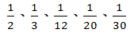
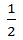
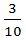
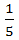
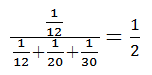
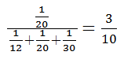
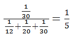

# 土地法第34條之1實例研習(二),許文昌老師

## 文章資訊
- 文章編號：413787
- 作者：許文昌
- 發布日期：2018/11/16
- 爬取時間：2025-02-02 18:13:35
- 原文連結：[閱讀原文](https://real-estate.get.com.tw/Columns/detail.aspx?no=413787)

## 內文
甲、乙、丙、丁、戊五人合夥購買土地一筆，投資額分別為3,000萬元、2,000萬元、500萬元、300萬元及200萬元。該土地登記為五人公同共有。試問：
(一)甲請求分割該共有土地，是否可行？
(二)甲、乙二人同意將該地全部出售於庚，是否可行？
(三)前款出售時，何人有優先購買權？如優先購買權人全體均主張時，應如何處理？
【解答】
(一)民法第668條規定：「各合夥人之出資及其他合夥財產，為合夥人全體之公同共有。」民法第829條規定：「公同關係存續中，各公同共有人，不得請求分割其公同共有物。」準此，甲不得請求分割該共有土地。
(二)土地法第34條之1第1項規定，於公同共有準用之。亦即，公同共有土地或建築改良物，其處分、變更及設定地上權、農役權、不動產役權或典權，應以共有人過半數及其潛在應有部分合計過半數之同意行之。但其潛在應有部分合計逾三分之二者，其人數不予計算。準此，甲、乙、丙、丁、戊之潛在應有部分（即 投資額）分別為

。甲、乙二人之潛在應有部分六分之五，已超過三分之二，人數不予計算。故甲、乙二人同意將該地全部出售於庚為可行。
(三)土地法第三十四條之一執行要點第11點第10款規定：「土地或建物之全部或應有部分為公同共有，部分公同共有人依本法條規定出賣該共有物全部或應有部分時，他公同共有人得就該公同共有物主張優先購買權，如有數人主張時，其優先購買權之範圍應按各主張優先購買權人之潛在應有部分比例計算之。」準此，丙、丁、戊三人有優先購買權。三人均主張優先購買權時，丙之優先購買權範圍為

，丁之優先購買權範圍為

，戊之優先購買權範圍為

。
丙：

丁：

戊：

---
*注：本文圖片存放於 ./images/ 目錄下*
