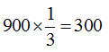

# 代為扣交與代為清償之實例研習,許文昌老師

## 文章資訊
- 文章編號：417670
- 作者：許文昌
- 發布日期：2020/02/06
- 爬取時間：2025-02-02 18:26:29
- 原文連結：[閱讀原文](https://real-estate.get.com.tw/Columns/detail.aspx?no=417670)

## 內文
甲有一筆A地，A地上有設定在先之乙的抵押權（債權額700萬元）及成立在後之丙的三七五租約。今政府實施土地徵收，並以市價查估補償900萬元，則政府應如何代為扣交及代為清償？
【解答】
(一)平均地權條例施行細則第46條第3項：「照價收買土地設有抵押權者，如其設定登記在耕地租約訂立之前，該抵押權人應優先於耕地承租人受償。」同理，土地徵收亦應適用。故政府應先代為清償（抵押權），再代為扣交（三七五租約）。
(二)土地徵收條例第36條規定，被徵收之土地或建築改良物原設定之他項權利因徵收而消滅。其款額計算，該管直轄市或縣（市）主管機關應通知當事人限期自行協議，再依其協議結果代為清償；協議不成者，其補償費存入專戶保管。因此，政府應代為清償700萬元予抵押權人乙。
(三)平均地權條例第11條第1項及第2項規定：「依法徵收或照價收買之土地為出租耕地時，除由政府補償承租人為改良土地所支付之費用，及尚未收穫之農作改良物外，並應由土地所有權人，以所得之補償地價，扣除土地增值稅後餘額之三分之一，補償耕地承租人。前項補償承租人之地價，應由主管機關於發放補償或依法提存時，代為扣交。」準此，政府原應補償三七五租約承租人300萬元（即

，土地徵收免徵土地增值稅），然代為清償抵押權後之餘額只剩200萬元，故政府應代為扣交200萬元予三七五承租人丙。

---
*注：本文圖片存放於 ./images/ 目錄下*
