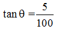

# 山坡地保育區、山坡地與原住民保留地,許文昌老師

## 文章資訊
- 文章編號：417899
- 作者：許文昌
- 發布日期：2020/02/20
- 爬取時間：2025-02-02 18:27:22
- 原文連結：[閱讀原文](https://real-estate.get.com.tw/Columns/detail.aspx?no=417899)

## 內文
(一)山坡地保育區：
非都市土地之分區種類共11種，其中一種分區為山坡地保育區。所稱山坡地保育區，指為保護自然生態資源、景觀、環境，與防治沖蝕、崩塌、地滑、土石流失等地質災害，及涵養水源等水土保育，依有關法規，會同有關機關劃定者（區域計畫法施行細則§11⑥）。
供山坡地保育區內建築使用者，編定為丙種建築用地（區域計畫法施行細則§13Ⅰ③）。
丙種建築用地之建蔽率不得超過40%，容積率不得超過120%，但直轄市或縣（市）政府得視實際需要酌予調降
（非都市土地使用管制規則§9Ⅰ③）。
(二)山坡地：
意義：所稱山坡地，係指國有林事業區、試驗用林地及保安林地以外，經中央或直轄市主管機關參照自然形勢、行政區域或保育、利用之需要，就合於下列情形之一者劃定範圍，報請行政院核定公告之公、私有土地：
標高在一百公尺以上者。
標高未滿一百公尺，而其平均坡度在百分之五以上者。（山坡地保育利用條例§3）
基此，標高在100公尺以上，不問坡度大小，均屬於山坡地。標高未滿100公尺，平均坡度在5%以上，始屬於山坡地。所稱5%，意謂

，如圖山坡地剖面所示。

山坡地與山坡地保育區之比較：
山坡地之劃定及管制依據山坡地保育利用條例及其施行細則，山坡地保育區之劃定及管制依據區域計畫法及其施行細則、非都市土地使用管制規則。
山坡地之保育與利用由農業發展委員會主管，山坡地保育區之土地使用由內政部主管。
山坡地存在於都市土地，亦存在於非都市土地。山坡地保育區僅存在於非都市土地。
山坡地保育區內之山坡地，除受到非都市土地使用管制規則之約束外，復受到山坡地保育利用條例之約束。此種管制方式稱為重疊土地使用管制。
總之，山坡地與山坡地保育區之範圍並非一致。因此有的土地屬於山坡地，但非屬於山坡地保育區；有的土地屬於山坡地保育區，但非屬於山坡地；有的土地屬於山坡地保育區，亦屬於山坡地。
山坡地之水土保持：在山坡地為下列經營或使用，其土地之經營人、使用人或所有人，於其經營或使用範圍內，應實施水土保持之處理與維護︰
宜農、牧地之經營或使用。
宜林地之經營、使用或採伐。
水庫或道路之修建或養護。
探礦、採礦、採取土石、堆積土石或設置有關附屬設施。
建築用地之開發。
公園、森林遊樂區、遊憩用地、運動場地或軍事訓練場之開發或經營。
墳墓用地之開發或經營。
廢棄物之處理。
其他山坡地之開發或利用。（山坡地保育利用條例§9）
山坡地之開發建築：建築技術規則第262條第3項規定，山坡地之平均坡度超過55%者，不得計入法定空地面積；其平均坡度超過30%且未逾55%者，得作為法定空地或開放空間使用，不得配置建築物。但因地區之發展特性或特殊建築基地之水土保持處理與維護之需要，經直轄市、縣（市）政府另定適用規定者，不在此限。
依據上開但書規定，台北市都市計畫劃定山坡地開發建築管制規定第2點，基地內原自然地形平均坡度超過30%者，除屬排水、截水溝或滯洪、沉砂及擋土安全之水土保持設施外，不得開挖整地及作為建築使用，亦不得計入檢討建蔽率及容積率，但得計入開發面積。
綜上，以台北市及新北市山坡地為例，其開發建築比較如下：
台北市山坡地之平均坡度超過30%，不得建築使用，亦不得計入法定空地面積。
新北市山坡地之平均坡度超過30%，未超過55%，不得建築使用，但得計入法定空地面積。平均坡度超過55%，不得建築使用，亦不得計入法定空地面積。
北市山坡地之開發建築管制較新北市嚴格。
(三)原住民保留地：
意義：所稱原住民保留地，指為保障原住民生計，推行原住民行政所保留之原有山地保留地及經依規定劃編、增編供原住民使用之保留地。（原住民保留地開發管理辦法§3）。
原住民保留地之處理
山坡地範圍內原住民保留地，除依法不得私有外，應輔導原住民取得承租權或無償取得所有權。
原住民取得原住民保留地所有權，如有移轉，以原住民為限。
有下列情形之一者，得由政府承受私有原住民保留地：
興辦土地徵收條例第3條、第4條第1項規定之各款事業及所有權人依該條例第8條規定申請一併徵收。
經中央原住民族主管機關審認符合災害之預防、災害發生時之應變及災後之復原重建用地需求。
稅捐稽徵機關受理以原住民保留地抵繳遺產稅或贈與稅。
因公法上金錢給付義務之執行事件未能拍定原住民保留地。
政府依前項第三款及第四款規定承受之原住民保留地，除政府機關依法撥用外，其移轉之受讓人以原住民為限。（山坡地保育利用條例§ⅠⅡⅢⅣ）
原住民無償取得土地面積之最高額：原住民申請無償取得原住民保留地所有權，土地面積最高限額如下：
依區域計畫法編定為農牧用地、養殖用地或依都市計畫法劃定為農業區、保護區，並供農作、養殖或畜牧使用之土地，每人1公頃。
依區域計畫法編定為林業用地或依都市計畫法劃定為保護區並供作造林使用之土地，每人1.5公頃。
依法得為建築使用之土地，每戶0.1公頃。
其他用地，其面積由中央主管機關視實際情形定之。（原住民保留地開發管理辦法§10）

---
*注：本文圖片存放於 ./images/ 目錄下*
