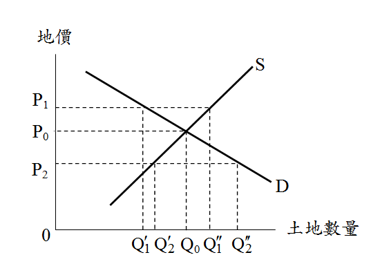

# 土地徵收之效率,許文昌老師

## 文章資訊
- 文章編號：905215
- 作者：許文昌
- 發布日期：2022/08/18
- 爬取時間：2025-02-02 17:05:32
- 原文連結：[閱讀原文](https://real-estate.get.com.tw/Columns/detail.aspx?no=905215)

## 內文
土地徵收除須顧及公平性外，並應考量效率性。膨脹計畫規模，浮濫徵收；相反地，緊縮計畫規模，縮減徵收。二者均非土地徵收之正途。唯有最適徵收規模，既不浮濫，也不拮据，始能發揮土地徵收之效率。
如圖所示，D代表政府徵收之土地需求曲線，S代表被徵收土地所有人之土地供給曲線。

當徵收補償地價偏高而為P
1
時，一方面政府視徵收為畏途（避免浪費公帑），縮小計畫規模，因而徵收需求量減少至Q’
1
；另一方面，土地所有人意外獲得橫財，因而鼓吹政府作無謂之徵收，徵收供給量增加至Q"
1
。此時，徵收市場發生供過於求，市場未能達成均衡。
當徵收補償地價偏低而為P
2
時，一方面政府視土地為廉價資源，膨脹計畫規模，因而徵收需求量增加至Q’
2
；另一方面，土地所有人財產受損，引發地主抗爭，因而徵收供給量減少至Q"
2
。此時，徵收市場發生供不應求，市場未能達成均衡。
當徵收補償地價合理且適當而為P
0
時，徵收需求量為Q
0
，徵收供給量亦為Q
0
，徵收市場發生供需平衡，市場達成均衡。此時，土地徵收最有效率。

---
*注：本文圖片存放於 ./images/ 目錄下*
