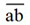
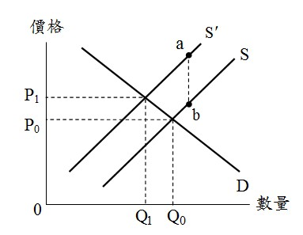
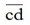
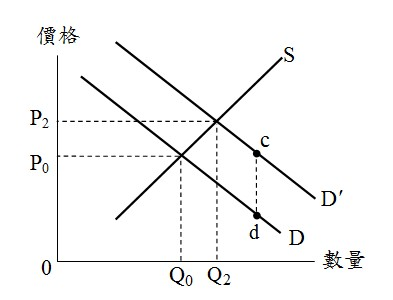
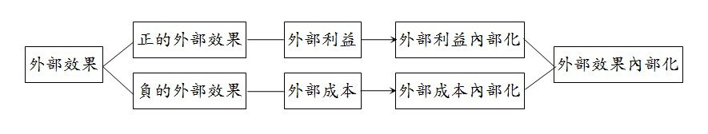

# 外部效果,許文昌老師

## 文章資訊
- 文章編號：907359
- 作者：許文昌
- 發布日期：2023/03/16
- 爬取時間：2025-02-02 17:33:09
- 原文連結：[閱讀原文](https://real-estate.get.com.tw/Columns/detail.aspx?no=907359)

## 內文
外部效果分為外部成本（亦稱外部不經濟）與外部利益（亦稱外部經濟）二種。
(一)外部成本
意義：土地開發或土地利用時，有一部分成本由開發者自己負擔，稱為私人成本或內部成本；另有一部分成本不由開發者自己負擔，而由社會整體負擔，稱為外部成本。
私人決策與社會決策不一致：外部成本造成私人決策與社會決策不一致，導致市場失靈之結果。如圖(一)所示，D表示土地開發利益曲線，S表示土地開發之私人成本曲線。由D與S之交點，決定私人土地開發之開發成本P
0
與開發數量Q
0
。如果私人土地開發存在外部成本

，S’表示土地開發之社會成本（私人成本 + 外部成本 = 社會成本），則由D與S’之交點，決定社會土地開發之開發成本P
1
與開發數量Q
1
。由此可知，如果未加入外部成本，開發者將以偏低之開發成本開發過多之土地數量。

圖(一)　外部成本
外部成本內部化：政府對外部成本予以課稅，使外部成本由開發者負擔，則開發者開發土地之數量將由Q
0
減少至Q
1
。
舉例：私人開發山坡地，除開發者自己負擔之開發成本（私人成本）外，亦造成土石流潛在風險增加（外部成本）。如果政府將外部成本予以內部化（如課徵開發影響費），將使山坡地開發數量減少。
(二)外部利益
意義：土地開發或土地利用時，有一部分利益由開發者自己享受，稱為私人利益或內部利益；另有一部分利益不由開發者自己享受，而由社會整體享受，稱為外部利益。
私人決策與社會決策不一致：外部利益造成私人決策與社會決策不一致，導致市場失靈之結果。如圖(二)所示，S表示土地開發成本曲線，D表示土地開發私人利益曲線。由D與S之交點，決定私人土地開發之開發利益P
0
與開發數量Q
0
。如果私人土地開發存在外部利益

，D’表示土地開發之社會利益（私人利益 + 外部利益 = 社會利益），則由D’與S之交點，決定社會土地開發之開發利益P
2
與開發數量Q
2
。由此可知，如果未加入外部利益，開發者將以偏低之開發利益開發過少之土地數量。

圖(二)　外部利益
外部利益內部化：政府對外部利益予以補貼，使外部利益由開發者享受，則開發者開發土地之數量將由Q
0
增加至Q
2
。
舉例：私人辦理都市更新，除開發者自己享受之開發利益（私人利益）外，亦造成都市機能復甦（外部利益）。如果政府將外部利益予以內部化（如租稅減免、容積獎勵等），將使都市更新數量增加。
(三)結論
外部成本造成私人成本與社會成本之分離，外部利益造成私人利益與社會利益之分離。
庇古（Pigou）主張，政府應對外部成本課徵租稅（此種租稅，稱為庇古租稅），對外部利益給予補貼（此種補貼，稱為庇古補貼）。其目的在使外部效果內部化，促使私人成本與社會成本一致、私人利益與社會利益一致，以解決市場失靈問題。

---
*注：本文圖片存放於 ./images/ 目錄下*
