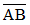
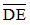
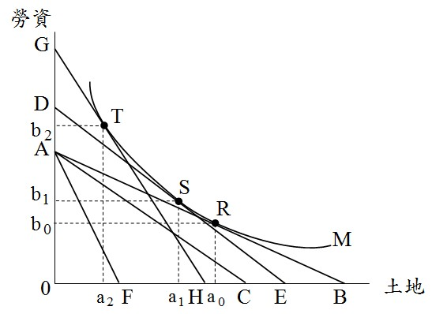
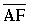
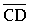
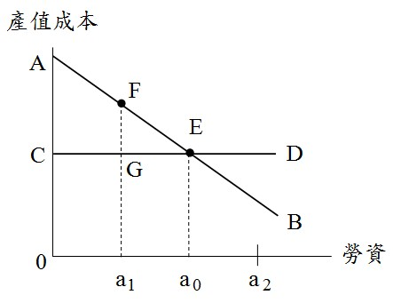

# 地價與土地集約度之關係,許文昌老師

## 文章資訊
- 文章編號：910031
- 作者：許文昌
- 發布日期：2023/12/21
- 爬取時間：2025-02-02 17:41:55
- 原文連結：[閱讀原文](https://real-estate.get.com.tw/Columns/detail.aspx?no=910031)

## 內文
土地集約度分為經濟集約度與法定集約度二種。前者指土地在無容積管制下，獲致最大利潤之集約度；後者指土地在容積管制下之集約度。
(一)地價影響經濟集約度：地價愈高，吾人將以勞資代替土地，因而土地集約度（指經濟集約度）提高。如圖(一)所示，有一塊土地，M代表等產量曲線（即使用土地及勞資二種生產要素可以興建一定樓地板面積）。
當地價為P
0
時，等成本線為

。M與

之切點R，決定土地投入量a
0
，勞資投入量b
0
，土地集約度為（b
0
/a
0
） ，此時興建透天厝產品。
當地價上漲為P
1
時，等成本線由

移至

。將

平行外移至

，且切在等產量曲線上，切點S，決定土地投入量a
1
，勞資投入量b
1
，土地集約度提高為（b
1
/a
1
），此時興建公寓產品。

圖(一)　地價影響經濟集約度
當地價再上漲為P2時，等成本線由

移至

。將

平行外移至

，且切在等產量曲線上，切點T，決定土地投入量a
2
，勞資投入量b
2
，土地集約度再提高為 ，此時興建高樓大廈產品。
綜上，地價不斷上漲，土地集約度（指經濟集約度）隨之提高。因此，地價會影響經濟集約度，但經濟集約度不會影響地價。此外，從一個都市發展歷程而言，起先興建透天厝，接著興建公寓，最後興建高樓大廈。
(二)法定集約度影響地價：政府以建蔽率、容積率等手段，限制土地集約度，以確保良好生活環境。如圖(二)所示，

代表建築投資之邊際產值曲線，

代表建築投資之邊際要素成本曲線（不包含土地成本）。由

與

之交點E，決定勞資投入量a
0
，此即經濟集約度，此時地價為△AEC（地價之決定同不動產估價技術規則第70條規定）。
當法定集約度為a
1
（即勞資投入量限制在a
1
以下）時，經濟集約度a
0
大於法定集約度a
1
，土地利用以法定集約度a
1
為準。此時地價下跌至□AFGC。
當法定集約度為a
2
（即勞資投入量限制在a
2
以下）時，經濟集約度a
0
小於法定集約度a
2
，土地利用以經濟集約度a
0
為準。此時地價仍為△AEC，不受影響。

圖(二)　法定集約度影響地價
綜上，當經濟集約度大於法定集約度時，法定集約度會影響地價，但地價不會影響法定集約度。當經濟集約度小於法定集約度時，法定集約度不會影響地價。
一般而言，都市繁榮地區經濟集約度大於法定集約度，土地利用以法定集約度為準，此時容積率用完；鄉村偏遠地區，經濟集約度小於法定集約度，土地利用以經濟集約度為準，此時容積率未用完。

---
*注：本文圖片存放於 ./images/ 目錄下*
