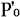
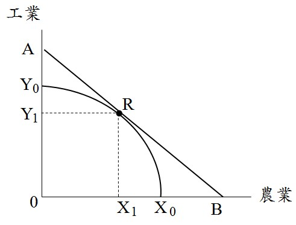
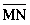
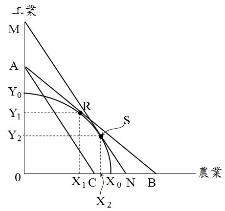
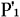
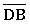
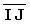
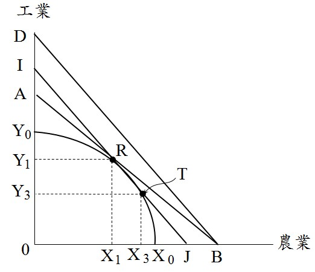

# 農工爭地,許文昌老師

## 文章資訊
- 文章編號：910147
- 作者：許文昌
- 發布日期：2023/12/28
- 爬取時間：2025-02-02 17:42:21
- 原文連結：[閱讀原文](https://real-estate.get.com.tw/Columns/detail.aspx?no=910147)

## 內文
一、農工爭地之意義
發展工業需要工業用地，生產糧食需要農業用地。但台灣之土地資源畢竟有限，如何妥善規劃用地需求，以維持工業發展與農業生產之均衡。
二、考慮外部性之用地需求
如圖(一)所示，台灣土地如果全部用於農業生產，農業產量X
0
；如果全部用於工業生產，工業產量Y
0
。設農業平均價格P
0
，工業平均價格

，則等收益線

。生產可能曲線X
0
Y
0
弧線與等收益線

之相切，切點R，決定農業產量X
1
，工業產量Y
1
。

圖(一)　農業產量與工業產量之最適組合
(一)考慮農業生產外部利益：農業之多功能性，農業生產具有外部利益，因此對農業之評價由P
0
上升為P
1
。如圖(二)所示，等收益線由

移至

。將

平行外移至

，且與生產可能曲線相切，切點S。此時，農業產量由X
1
增加至X
2
，工業產量由Y
1
減少至Y
2
。總之，考慮農業之外部利益，增加農業用地，以增加農業產量；減少工業用地，以減少工業產量。

圖(二)　考慮農業外部利益之產量變化
(二)考慮工業生產之外部成本：工業造成環境污染，工業生產具有外部成本，因此對工業之評價由

下降為

。如圖(三)所示，等收益線由

移至

。將

平行內移至

，且與生產可能曲線相切，切點T。此時，農業產量由X
1
增加至X
3
，工業產量由Y
1
減少至Y
3
。總之，考慮工業之外部成本，增加農業用地，以增加農業產量；減少工業用地，以減少工業產量。

圖(三)　考慮工業外部成本之產量變化

---
*注：本文圖片存放於 ./images/ 目錄下*
