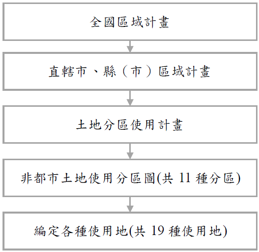

# 非都市土地使用管制架構,曾榮耀老師

## 文章資訊
- 文章編號：912059
- 作者：蘇偉強
- 發布日期：2024/07/23
- 爬取時間：2025-02-02 17:48:26
- 原文連結：[閱讀原文](https://real-estate.get.com.tw/Columns/detail.aspx?no=912059)

## 內文
依據「區域計畫法」第15條第1項規定：「區域計畫公告實施後，不屬第11條之非都市土地（即變更為都市計畫者），應由有關直轄市或縣（市）政府，按照
非都市土地分區使用計畫，製定非都市土地使用分區圖，並編定各種使用地，報經上級主管機關核備後，實施管制
。變更之程序亦同。其管制規則，由中央主管機關定之。」因此，內政部依據該條文授權，訂定「非都市土地使用管制規則」，作為實施非都市土地使用管制之依據。依該規則第4條，非都市土地之使用，除國家公園區內土地，由國家公園主管機關依法管制外，按其編定使用地之類別，依本規則規定管制之。
按「區域計畫法」第7條第9款、第15條及同法施行細則第5條規定，區域土地使用管制之結構，可分為三個層次：
上層：
土地分區使用計畫
。
中層：
非都市土地使用分區圖
。
下層：
編定各種使用地
。
上述三層次，
分別具有上下位之指導關係
，即製定非都市土地使用分區圖，須受土地分區使用計畫之指導；編定各種使用地，則須受非都市土地使用分區圖所定之使用區容許使用種類之限制。
非都市土地使用管制架構如下圖所示：

---
*注：本文圖片存放於 ./images/ 目錄下*
