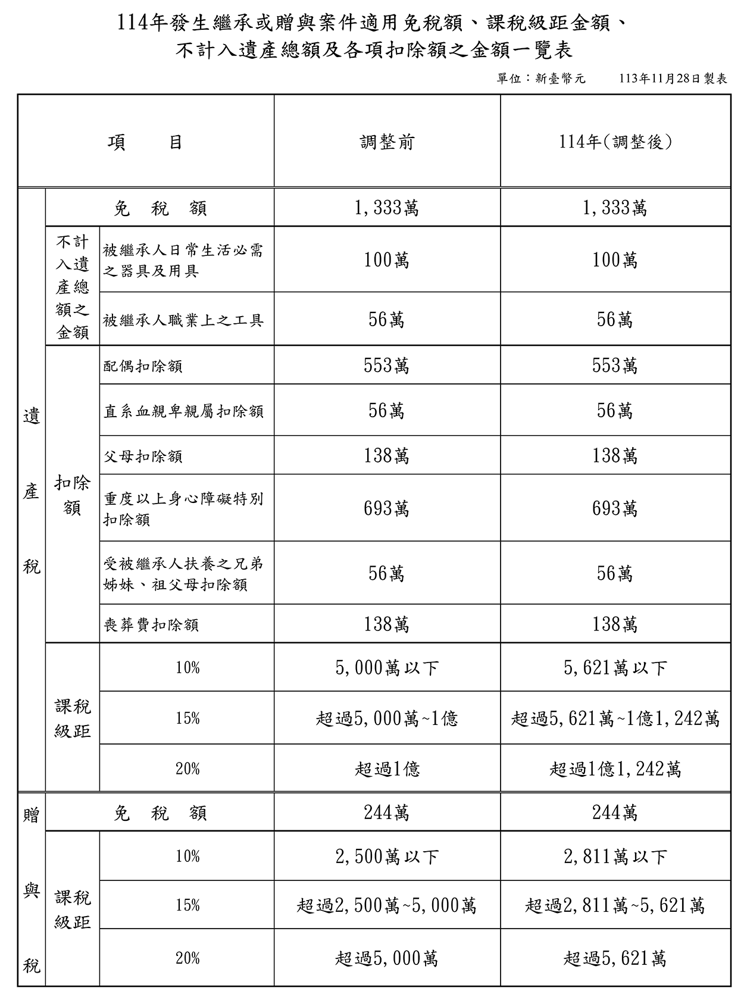

# 114年贈與稅計算範例,曾榮耀老師

## 文章資訊
- 文章編號：913190
- 作者：蘇偉強
- 發布日期：2024/12/31
- 爬取時間：2025-02-02 17:52:18
- 原文連結：[閱讀原文](https://real-estate.get.com.tw/Columns/detail.aspx?no=913190)

## 內文
某甲為經常居住於中華民國境內之中華民國國民，於民國114年4月贈與其兒一筆公告土地現值加房屋評定標準價格共計7,350萬元之不動產，受贈人所納契稅及土地增值稅合計500萬元，試問其應納贈與稅為多少？
解答：
一、公告114年發生繼承或贈與案件適用遺產稅、贈與稅之免稅額、課稅級距金額、不計入遺產總額及各項扣除額之金額

資料來源：財政部，2024.11.28
二、計算
(一)贈與總額：贈與稅按贈與人每年贈與總額，減除規定之扣除額及免稅額後之課稅贈與淨額。其中，贈與財產價值之計算，以贈與人贈與時之時價為準；被繼承人如係受死亡之宣告者，以法院宣告死亡判決內所確定死亡日之時價為準。所稱時價，土地以公告土地現值或評定標準價格為準；房屋以評定標準價格為準；其他財產時價之估定，本法未規定者，由財政部定之。
因此，本題贈與總額為7,350(萬元)
(二)扣除額：契稅及土地增值稅扣除額500(萬元)
(三)免稅額：244(萬元)
(四)課稅贈與淨額＝贈與總額－扣除額－免稅額
＝（7,350－500－244）＝6,606(萬元)
(五)適用稅率：贈與稅按贈與人每年贈與總額，減除規定之扣除額及免稅額後之課稅贈與淨額，依下列稅率課徵之：
2,500萬元以下者，課徵10%。
超過2,500萬元至5,000萬元者，課徵250萬元，加超過2,500萬元部分之15%。
超過5,000萬元者，課徵625萬元，加超過5,000萬元部分之20%。
惟114年課稅級距須依最新物價調整後金額計算，即：
贈與淨額2,811萬元以下者，課徵10%。
超過2,811萬元至5,621萬元者，課徵281萬1,000元，加超過5,621萬元部分之15%。
超過5,621萬元者，課徵702萬6,000元，加超過5,621萬元部分之20%。
(六)贈與稅應納稅額
贈與稅應納稅額＝2,811*10%+2,810×15%+(6,606-5,621)×20%
＝899.6(萬元)

---
*注：本文圖片存放於 ./images/ 目錄下*
