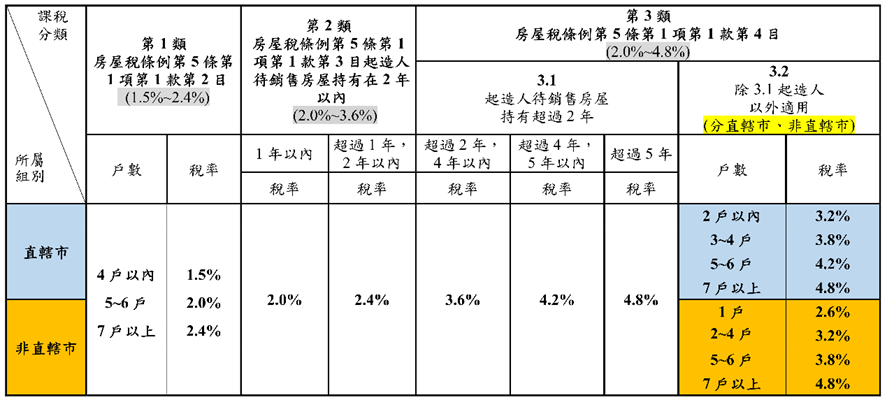

# 房屋稅計算範例

## 文章資訊
- 文章編號：915580
- 作者：曾榮耀(蘇偉強)
- 發布日期：2026/05/05
- 關鍵詞：房屋稅課稅、房屋稅
- 爬取時間：2026-05-05 13:09:13
- 原文連結：[閱讀原文](https://real-estate.get.com.tw/Columns/detail.aspx?no=915580)

## 內文
甲為自然人，於115年期房屋稅課稅年度持有下列9戶住家用房屋，均坐落於臺中市，且均為甲單獨所有。甲已於法定期限內完成相關使用情形申報，且各戶均全年持有、全年使用情形不變。試問：甲114年期各戶房屋之房屋課稅現值、適用稅率及應納房屋稅各為多少？總應納房屋稅為多少？

• T. ABLE_PLACEHOLDER_1

註：請依據所附各縣市適用稅率級距計算。

[圖片1]

解答

• (一) 計算各戶房屋現值

房屋現值＝核定單價 × 面積 ×（1－折舊率 × 折舊年數）× 路段率

• T. ABLE_PLACEHOLDER_2

• (二) 判斷各房屋適用稅率

本題應先依房屋使用情形分類，而非單純以甲持有9戶全部合併適用同一稅率。

1. 自住住家用房屋 A、B屋均供自住使用，且已設戶籍，合計2戶，未超過全國3戶限制，故適用自住住家用稅率：A、B屋＝1.2%。

2. 出租達租金標準及繼承取得共有房屋 C屋為出租且申報所得達租金標準；D、I屋為繼承取得共有房屋。C、D、I合計為3戶，屬4戶以下，故適用稅率：C、D、I屋＝1.5%。

3. 其他非自住住家用房屋 E、F、G、H屋均為空置未使用，屬其他非自住住家用房屋合計4戶，屬3至4戶級距，故適用較高稅率：E、F、G、H屋＝3.8%。

• (三) 計算各戶應納房屋稅

• T. ABLE_PLACEHOLDER_3

因此，甲114年期房屋稅總額為各戶加總＝172,220元。

## 文章圖片

---
*注：本文圖片存放於 ./images/ 目錄下*
