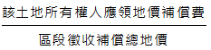

# 區段徵收抵價地補償之問題,許文昌老師

## 文章資訊
- 文章編號：409209
- 作者：許文昌
- 發布日期：2017/01/05
- 關鍵詞：區段徵收、現金補償、抵價地補償、土地徵收條例
- 爬取時間：2025-02-02 20:23:52
- 原文連結：[閱讀原文](https://real-estate.get.com.tw/Columns/detail.aspx?no=409209)

## 內文
區段徵收之補償方式有兩種，其一為現金補償，另一為抵價地補償。抵價地補償為現金補償之替代物。準此，抵價地價值應與現金補償相當，始符合土地徵收補償之原理。換言之，若抵價地價值高於或低於現金補償，均違反土地徵收條例第30條之市價補償精神。

依土地徵收條例第44條第1項第1款規定，土地所有權人應領回抵價地之面積，由該管直轄市或縣（市）主管機關按其應領地價補償費與區段徵收補償地價總額之比率計算其應領之權利價值，並以實際領回抵價地之單位地價折算之。準此，其計算方法如下：

1. 先決定抵價地總面積。即：徵收土地總面積×抵價地比例（抵價地比例為40%～50%）

2. 嗣決定抵價地總地價。即：抵價地分配之各街廓面積×各該分配街廓評定之單位地價

3. 再決定各原土地所有權人應領回抵價地之權利價值。即：抵價地總地價×[圖片1]

4. 最後決定各原土地所有權人領回抵價地之面積。即：各原土地所有權人應領回抵價地之權利價值÷領回土地之評定單位地價

由上述分析可知，原土地所有權人領回抵價地之價值受領回抵價地面積大小及抵價地單價高低之影響。又，原土地所有權人領回抵價地之面積大小又受徵收土地總面積、抵價地比例、該土地所有權人應領地價補償費占區段徵收補償地價總額之比例、抵價地之評定單位地價等因素之影響。

總之，原土地所有權人領回抵價地之價值與市價現金補償脫節。倘領回抵價地之價值大於市價現金補償，則原土地所有權人選擇領回抵價地；倘領回抵價地之價值小於市價現金補償，則原土地所有權人選擇領取現金。如此，原土地所有權人領回抵價地有暴利現象，造成官商勾結。地方政府以推動土地開發建設為名，行炒作投機之實，以充實地方財政收入。

## 文章圖片

## 文章圖片

## 文章圖片

---
*注：本文圖片存放於 ./images/ 目錄下*
