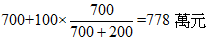
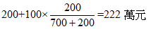
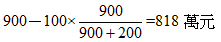
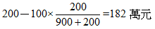

# 房地市場價格分析(一),許文昌老師

## 文章資訊
- 文章編號：409221
- 作者：許文昌
- 發布日期：2017/04/13
- 關鍵詞：房地市場價格、土地貢獻價值、建物貢獻價值
- 爬取時間：2025-02-02 20:23:59
- 原文連結：[閱讀原文](https://real-estate.get.com.tw/Columns/detail.aspx?no=409221)

## 內文
所稱房地市場價格，指建物及其基地之市價，亦即房地結合體之市價。本文所稱之價格，皆指總價而言。茲就原料與產品二方面分析說明：

• (一) 就原料而論：

1. 素地價格：指不考慮房地產品對土地價格之影響，而單就土地在最有效使用下之價格。土地有增值，而無折舊。

2. 建物成本價格：指不考慮房地產品對建物價格之影響，而單就建物在時間經歷下之價格。建物有折舊，而無增值。

3. 房地市場價格之構成：素地價格與建物成本之和，未必等於房地市場價格。亦即： 素地價格+建物成本價格≠房地市場價格茲分下列二種情形：(1)素地價格+建物成本價格＜房地市場價格：表示土地與建物二種原料結合而成為產品時，存在「利潤」。換言之，產品價格大於原料價格。通俗的說，麵包價格大於麵粉價格。(2)素地價格+建物成本價格＞房地市場價格：表示土地與建物二種原料結合而成為產品時，存在「虧損」。換言之，產品價格小於原料價格。通俗的說，麵包價格小於麵粉價格。

• (二) 就產品而論：

房地市場價格可以拆分為土地價格與建物價格二部份。前者稱為土地貢獻價值；後者稱為建物貢獻價值。亦即：房地市場價格=土地貢獻價值+建物貢獻價值

拆分之方法有三：

1. 土地貢獻說：將利潤或虧損歸屬於土地之貢獻。

2. 建物貢獻說：將利潤或虧損歸屬於建物之貢獻。

3. 聯合貢獻說：將利潤或虧損歸屬於土地及建物二者共同之貢獻。

[例題]

房地市場價格1,000萬元，素地價格700萬元，建物成本價格200萬元。1,000－700－200=100萬元(利潤)

1. 土地貢獻說：①土地貢獻價值：700+100=800萬元②建物貢獻價值：200萬元

2. 建物貢獻說：①土地貢獻價值：700萬元②建物貢獻價值：200+100=300萬元

3. 聯合貢獻說：①土地貢獻價值：[圖片1]②建物貢獻價值：[圖片2]

房地市場價格1,000萬元，素地價格900萬元，建物成本價格200萬元。1,000－900－200= -100萬元(虧損)

1. 土地貢獻說：①土地貢獻價值：900－100=800萬元②建物貢獻價值：200萬元

2. 建物貢獻說：①土地貢獻價值：900萬元②建物貢獻價值：200－100=100萬元

3. 聯合貢獻說：①土地貢獻價值：[圖片3]②建物貢獻價值：[圖片4]

待續...

## 文章圖片

## 文章圖片

## 文章圖片

---
*注：本文圖片存放於 ./images/ 目錄下*
