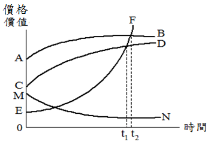

# 房地市場價格分析(二),許文昌老師

## 文章資訊
- 文章編號：409243
- 作者：許文昌
- 發布日期：2017/04/20
- 爬取時間：2025-02-02 20:24:02
- 原文連結：[閱讀原文](https://real-estate.get.com.tw/Columns/detail.aspx?no=409243)

## 內文
接續上篇...

(三)圖形分析：

[圖片1]

AB代表房地市場價格。CD代表土地貢獻價值。EF代表素地價格。MN代表建物成本價格。

1. 房地市場價格AB呈遞增現象，但邊際價格呈遞減趨勢。所稱邊際價格，即△P／△t，△t指時間變動量，△P指價格變動量。

2. 房地市場價格AB與土地貢獻價值CD之垂直間距，等於建物貢獻價值。由於土地存在增值，建物存在折舊，因此AB與CD之垂直間距逐漸縮小。

3. 素地價格EF呈遞增現象，且邊際價格(即△P／△t )亦呈遞增趨勢。

4. 建物成本價格MN呈遞減現象，此乃折舊所造成。

5. 在t1之前，產品價格大於原料價格，即原料製造成產品存有利潤。在t1之後，產品價格小於原料價格，即原料製造成產品存有虧損。因此，在t1之後，建物拆除重建可以考慮進行。

6. 在t2之後，素地價格大於房地市場價格，表示建物已無存在價值。因此，在t2之後建物拆除重建必須儘速進行。

## 文章圖片

---
*注：本文圖片存放於 ./images/ 目錄下*
