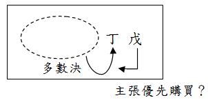

# 106高考土地法規，有關共有之題型解析,曾榮耀老師

## 文章資訊
- 文章編號：410103
- 作者：曾榮耀
- 發布日期：2017/10/26
- 關鍵詞：土地法34-1
- 爬取時間：2025-02-02 20:27:14
- 原文連結：[閱讀原文](https://real-estate.get.com.tw/Columns/detail.aspx?no=410103)

## 內文
各位同學好

今日專欄來說明一下，106年之高考土法，其中一題有關共有之題型：

多數決處分整筆共有地給共有人之一，其他共有人得否優先購買？

甲、乙、丙、丁、戊5人共有A地號土地一筆，其應有部份均各五分之一。現甲、乙、丙、三人擬依土地法第34條之1第1項規定，將A地號土地全部出賣於共有人之一丁；於此情形，戊對於該A地號是否有優先購買權？請析論之。(106高)

[圖片1]

• (一) 肯定說：

1. 共有人權益保障：共有人甲乙丙丁如聯合以顯不相當對價出賣共有物，並指定其中一共有人丁為承買人之情形（聯想因不得多數決處分給同意共有人但卻可給不同意共有人，故衍生原本同意者可能會假裝為不同意者，即可多數決處分給他），如不給戊優先購買，將影響其權益，以貫徹立法共有人權益衡平。

2. 性質：部分共有人依本法條規定出賣共有土地或建物，就該共有人而言，仍為出賣其應有部分，對於他共有人之應有部分，僅有權代為處分，並非剝奪他共有人之優先承購權，故應在程序上先就其應有部分通知他共有人是否願意優先購買。

• (二) 否定說

1. 目的：土地法34-1第一項目的為促進有效利用、增進公共利益、解決共有糾紛及便利不動產交易，與同法條第四項係為簡化消滅共有關係，防止共有土地落入他人之手之立法目的不同。反而使土§34-1第一項之立法目的難於實現，應不予適用。此外，多數決處分給丁，已達成簡化及消滅共有關係，繼由丁優先購買並未有助於第四項立法目的之達成。

2. 性質：根據土地法34-1執行要點第10點：「共有人出賣其應有部分，除買受人同為共有人外，他共有人對共有人出賣應有部分之優先購買權，均有同一優先權」，亦即共有人互為買賣應有部分時，他共有人無優先購買權，故本案例等同於甲、乙、丙，加有權代理戊之應有部分共同移轉給丁，故戊不得優先購買。

綜合上述，肯定說站在共有人之間權益衡平之立場，而否定說則從法條目的、體系而言，兩者皆有理。惟今多數決處分之承受人仍為共有人之一，與出售給第三人不同，為避免實務上可能有以大吃小，反將造成他共有人權益更加受損，基於共有人間權益衡平之價值判斷，仍建議修法明定如他共有人亦表示優先購買，則各按應有部分比例共同購買。

## 文章圖片

## 文章圖片

## 文章圖片

---
*注：本文圖片存放於 ./images/ 目錄下*
