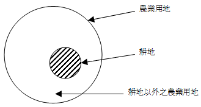

# 農業用地之移轉限制及土地增值稅徵納(一),許文昌老師

## 文章資訊
- 文章編號：410104
- 作者：許文昌
- 發布日期：2017/10/26
- 爬取時間：2025-02-02 20:27:12
- 原文連結：[閱讀原文](https://real-estate.get.com.tw/Columns/detail.aspx?no=410104)

## 內文
(一)農業用地之分類：

依農業發展條例第3條第10款及第11款對農業用地與耕地之定義如下：

1. 農業用地：指非都市土地或都市土地農業區、保護區範圍內，依法供下列使用之土地：(1)供農作、森林、養殖、畜牧及保育使用者。(2)供與農業經營不可分離之農舍、畜禽舍、倉儲設備、曬場、集貨場、農路、灌溉、排水及其他農用之土地。(3)農民團體與合作農場所有直接供農業使用之倉庫、冷凍（藏）庫、農機中心、蠶種製造（繁殖）場、集貨場、檢驗場等用地。（農§3Ⅹ，所稱「農」，指農業發展條例，以下同）

2. 耕地：指依區域計畫法劃定為特定農業區、一般農業區、山坡地保育區及森林區之農牧用地。（農§3Ⅺ）

綜上，農業用地涵括耕地，因此農業用地可分為耕地與耕地以外之農業用地二種。茲以示意圖說明如下：

[圖片1]

(二)耕地之移轉及土地增值稅：

人分為自然人與法人。法人又分為私法人與公法人。所稱私法人，指依私法而成立之法人。所稱公法人，指依公法而成立之法人。

1. 移轉於自然人：耕地得移轉於自然人，如作農業使用並得申請不課徵土地增值稅（農§37Ⅰ）。

2. 移轉於私法人：耕地不得移轉於私法人。但經中央主管機關許可，耕地得移轉於農民團體（如農會、漁會等）、農業企業機構或農業試驗研究機構（農§33）。又，作農業使用之耕地依規定移轉與農民團體、農業企業機構及農業試驗研究機構時，其符合產業發展需要、一定規模或其他條件，經直轄市、縣（市）主管機關同意者，得申請不課徵土地徵值稅（農§37Ⅱ）。

3. 移轉於公法人：耕地得移轉於公法人，並應繳納土地增值稅。

(三)耕地以外之農業用地之移轉及土地增值稅：

1. 移轉於自然人：耕地以外之農業用地得移轉於自然人，如作農業使用並得申請不課徵土地增值稅。

2. 移轉於私法人：耕地以外之農業用地得移轉於私法人，並應課徵土地增值稅。

3. 移轉於公法人：耕地以外之農業用地得移轉於公法人，並應課徵土地增值稅。

(四)舉例：下周待續...

## 文章圖片

---
*注：本文圖片存放於 ./images/ 目錄下*
