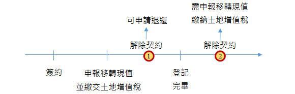

# 契約解除之退稅請求權,曾榮耀老師

## 文章資訊
- 文章編號：410134
- 作者：曾榮耀
- 發布日期：2017/11/02
- 爬取時間：2025-02-02 20:27:18
- 原文連結：[閱讀原文](https://real-estate.get.com.tw/Columns/detail.aspx?no=410134)

## 內文
各位同學好

今日專欄來談談買賣契約解除時，土地增值或契約究竟得否申請退還？

就目前稅捐機關之相關函釋予以彙整如下：

首先，解除契約應注意兩個時點之差異，一為登記完畢前，另一為登記完畢後

[圖片1]

1. 尚未登記完畢買賣雙方因故解除土地移轉契約，如尚未至地政事務所辦竣土地產權登記，可向原申報稅務機關申請撤回土地增值稅申報，並退還已繳納的土地增值稅。 該退稅請求權時效，依行政程序法第131條，自該契約解除之日起算，因10年間不行使而消滅。（此處注意網路查到的資料很多說是5年的，自102年行政程序法修正後，102年後的退稅請求權時效應改為10年）

2. 登記完畢後實際上，解除契約亦兩種情形：(1)雙方合意、(2)法院判決，處理有所不同：

1. 雙方合意解除契約由於契約解除僅具債權效力並不生物權效力，買方取得不動產所有權的法律行為仍為有效，並不會因契約的解除而受影響，故其必須將不動產所有權再行辦理移轉登記返還予賣方，其屬另一次物權移轉行為。又因買方取得不動產所有權是為有效的，故原已繳納的土地增值稅及契稅是無法因為主張解除契約而請求退還的。 換言之，合意解除契約返還給付物，仍屬所有權移轉行為，應辦理所有權移轉登記。既然屬於土地所有權之移轉，除符合法定減免或不課徵要件者外，仍應課徵土地增值稅，且不能申請退還先前已繳納之稅款。但實際上前次移轉現值已墊高，此次可能無應納稅額。

2. 法院判決確定或調解成立解除契約若法院判決確定(或法院民事調解成立)其買賣關係不存在，應持相關資料逕向地政機關辦理塗銷登記，這樣就無須再向稅捐稽徵機關申報土地增值稅。辦竣塗銷登記後，再向地方稅務局申請退還原繳納之稅款。

至於建物所有權之移轉，不涉及土地增值稅之徵免問題；惟契稅之課徵，依契稅條例第2條規定：「不動產之買賣、承典、交換、贈與、分割或因占有而取得所有權者，均應申報繳納契稅。但在開徵土地增值稅區域之土地，免徵契稅。」準此，已辦竣所有權買賣移轉登記之建物，因契約解除所為返還給付物之所有權移轉行為，非屬上述條文所訂六項契稅課稅原因之範圍者，尚無課徵契稅問題。

此外，有關已辦竣所有權移轉登記之建物，事後因雙方合意解除契約案件，應以「買賣」為登記原因，並依84年4月7日台內地字第8405408號函釋意旨於其他登記事項欄予以註記「本案為雙方合意解除契約」，使與一般買賣移轉案件有所區別。另查合意解除契約雖以買賣為登記原因，惟其成立之要件係因解除契約而返還給付物，故無須訂定公定買賣契約書，得以雙方合意解除之相關證明文件辦理所有權移轉登記。

參考資料來源：

1. 土地增值稅稽徵實務 105.4.19

2. 台財稅字第861927148號函釋

3. 台財稅字第09504545380號

4. 內授中辦地字第0940044433號函

5. 內授中辦地字第0960045649號函

6. 王彥琳，2014，買賣雙方合意解除契約而為返還不動產之產權登記及稅務解析

7. 財政部稅務新聞：已辦竣移轉登記之土地，因解除契約返還給付物而再移轉，仍應申報移轉現值，且無法退還原繳納之土地增值稅

## 文章圖片

---
*注：本文圖片存放於 ./images/ 目錄下*
