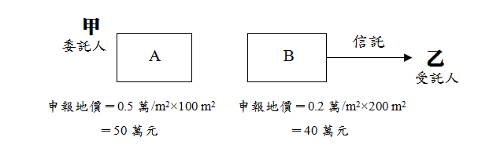
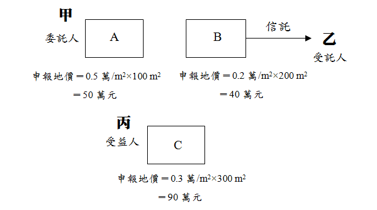

# 信託之地價稅,曾榮耀老師

## 文章資訊
- 文章編號：410230
- 作者：曾榮耀
- 發布日期：2017/11/16
- 關鍵詞：地價稅、土地稅法、信託土地、自益信託、他益信託
- 爬取時間：2025-02-02 20:27:40
- 原文連結：[閱讀原文](https://real-estate.get.com.tw/Columns/detail.aspx?no=410230)

## 內文
各位同學好

剛好有幾位同學都問到103年經紀人其中一題有關信託土地之地價稅課徵方式，今日專欄統一說明：

首先，103年經紀人土法土稅第12題：某甲擁有A、B兩筆住宅區土地，A地當年度課徵地價稅之申報地價為5,000元/m2，面積100m2，B地當年度課徵地價稅之申報地價為2,000元/m2，面積200m2，某甲將B地信託與某乙，某乙名下無任何土地，某甲享有全部信託利益，信託10年，目前尚有3年信託期滿，若A、B兩筆土地均在同一縣市，該縣市當年度累進起點地價為100萬元，若某甲當年度未申請A、B兩地為自用住宅用地，則某甲當年度應繳地價稅為：(A)5,000元 (B)9,000元 (C)4,000元 (D)3,000元

[圖片1]

• 一、信託納稅義務人

土地稅法第3條之1：土地為信託財產者，於信託關係存續中，以受託人為地價稅之納稅義務人。

甲（委託人）將B地信託給乙（受託人），乙即為地價稅之納稅義務人。

• 二、稅基＝申報地價總額之計算方式

土地稅法第3條之1：信託土地應與委託人在同一直轄市或縣(市)轄區內所有之土地合併計算地價總額，依第十六條規定稅率課徵地價稅，分別就各該土地地價占地價總額之比例，計算其應納之地價稅。但信託利益之受益人為非委託人且符合左列各款規定者，前項土地應與受益人在同一直轄市或縣(市)轄區內所有之土地合併計算地價總額：1.受益人已確定並享有全部信託利益者。2.委託人未保留變更受益人之權利者。

立法意旨：避免納稅義務人為逃避適用累進稅率，故意將土地信託出去。因此，如果屬於自益信託，土地最終歸屬委託人自己，即視為該土地之實質所有權人還是委託人自己，該信託出去的土地就要跟委託人土地併計，該累進就累進，算完委託人應徵稅額後，再透過土地申報地價之比分算給受託人繳。然而，如果該信託屬於他益信託，此時實質所有權人為受益人，且委託人沒有變更權利，即受益人是明確的，故就要跟受益人所有土地合併計算申報地價總額。

• 三、應徵稅額

信託土地分成兩種情形：

• (一) 自益信託

本題因某甲享有全部信託利益故屬自益信託，此時甲為實質所有權人，故該信託土地仍要與甲所有土地合併計算申報地價總額：

• A. 地＝0.5萬/m2×100m2＝50萬元

• B. 地＝0.2萬/m2×200m2＝40萬元

甲應徵稅額＝A+B地＝90萬元，因未超過該縣市當年度累進起點地價為100萬元，故以基本稅率10‰計算＝90萬元×10‰＝9,000元

甲為A地納稅義務人，其應繳稅額＝9,000元×50/90＝5,000元

乙為B地納稅義務人，其應繳稅額＝9,000元×40/90＝4,000元

因此，本題答案為(A)。

• (二) 他益信託

假設本案例為他益信託，受益人為丙，且甲未保留變更受益人丙之權利，此時，B地就要跟丙之所有財產合計。茲舉例如下圖所示：

[圖片2]

• A. 地＝0.5萬/m2×100m2＝50萬元

• B. 地＝0.2萬/m2×200m2＝40萬元

• C. 地＝0.3萬/m2×300m2＝90萬元

甲為A地納稅義務人，因未超過該縣市當年度累進起點地價為100萬元，故以基本稅率10‰計算＝50萬元×10‰＝5,000元

丙應徵稅額＝B+C地＝130萬元，因超過該縣市當年度累進起點地價100萬元，未達五倍，故以稅率15‰計算＝100萬元×10‰＋30萬元×15‰＝14,500元（速算＝130萬元×15‰－100萬元×0.005）

乙為B地納稅義務人，其應繳稅額＝14,500元×40/130＝4,462元

丙為C地納稅義務人，其應繳稅額＝14,500元×90/130＝10,038元

## 文章圖片

## 文章圖片

## 文章圖片

---
*注：本文圖片存放於 ./images/ 目錄下*
