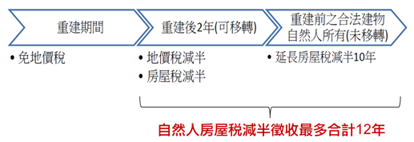

# 危老條例稅捐減免,曾榮耀老師

## 文章資訊
- 文章編號：413587
- 作者：蘇偉強
- 發布日期：2018/10/25
- 關鍵詞：危老條例
- 爬取時間：2025-02-02 20:38:52
- 原文連結：[閱讀原文](https://real-estate.get.com.tw/Columns/detail.aspx?no=413587)

## 內文
各位同學好

今日專欄針對「都市危險及老舊建築物加速重建條例」之稅捐減免優惠予以彙整要件如下：

首先，危老條例第8條規定：本條例施行後五年內申請之重建計畫，重建計畫範圍內之土地及建築物，經直轄市、縣（市）主管機關視地區發展趨勢及財政狀況同意者，得依下列規定減免稅捐(危§8I)：一、重建期間土地無法使用者，免徵地價稅。但未依建築期限完成重建且可歸責於土地所有權人之情形者，依法課徵之。二、重建後地價稅及房屋稅減半徵收二年。三、重建前合法建築物所有權人為自然人者，且持有重建後建築物，於前款房屋稅減半徵收二年期間內未移轉者，得延長其房屋稅減半徵收期間至喪失所有權止，但以十年為限。

依本條例適用租稅減免者，不得同時併用其他法律規定之同稅目租稅減免。但其他法律之規定較本條例更有利者，適用最有利之規定。(危§8II)

第一項規定年限屆期前半年，行政院得視情況延長之，並以一次為限。(危§8III)

茲整理要件如下：

• 一、五年內申請

• T. ABLE_PLACEHOLDER_1

• 二、地方政府同意：房屋稅及地價稅屬地方稅，為地方政府重要財源，目前地方財政拮据，為避免影響地方政府建設，新增或修正擴大租稅減免範圍允宜尊重地方政府意見

• 三、符合以下情形

[圖片1]

其中，應注意減半優惠延長之要件如下：

1. 僅有房屋稅得以延長。

2. 所有權人為重建前、後之自然人。

3. 重建後2年未移轉。

4. 延長期限至喪失所有權為止，最多延長10年，加計重建後2年之減半優惠，共計房屋稅最多可享受12年之減半徵收優惠。

5. 延長期間喪失所有權，包含有償移轉、無償移轉、繼承、信託皆屬之。（亦即租稅延長期間，因子女繼承而移轉，房屋稅減半優惠即結束）

## 文章圖片

## 文章圖片

## 文章圖片

---
*注：本文圖片存放於 ./images/ 目錄下*
