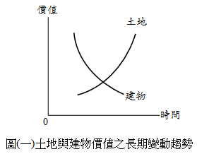
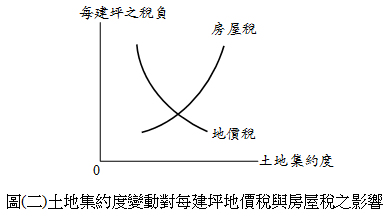
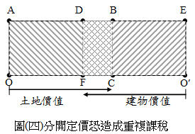

# 地價稅與房屋稅合併課稅,許文昌老師

## 文章資訊
- 文章編號：420127
- 作者：許文昌
- 發布日期：2020/10/29
- 爬取時間：2025-02-02 21:00:52
- 原文連結：[閱讀原文](https://real-estate.get.com.tw/Columns/detail.aspx?no=420127)

## 內文
地價稅為土地持有稅，房屋稅為建物持有稅。兩者宜分開課稅，抑或合併課稅？爭議不休。

(一)主張分開課稅之理由：

1. 土地與建物之性質不同：土地不會折舊，但會增值；建物不會增值，但會折舊。因此，土地價值隨時間經過而遞增，建物價值隨時間經過而遞減。如圖(一)所示。

[圖片1]

2. 土地與建物之政策不同：土地愈集約利用，每建坪之地價稅愈來愈少。土地愈集約利用，每建坪之房屋稅愈來愈多。如圖(二)所示，因此，地價稅會促進土地利用，房屋稅會阻礙土地利用。故地價稅應從重，房屋稅應從輕。

[圖片2]

3. 土地與建物之稅率不同：現行地價稅採累進稅，現行房屋稅採比例稅，兩者難以合併。

總之，土地法第145條規定：「土地及其改良物之價值，應分別規定。」據此，土地與建物應分別定價，分開課稅。

(二)主張合併課稅之理由：

1. 現制恐造成稅基流失或重複課稅：

1. 稅基流失：現行採土地與建物分開定價，可能發生稅基流失。如圖(三)所示，假定整體房地市價為□AEO′O，土地由左而右定價，土地價值原點為O，定價在C；建物由右而左定價，建物價值原點為O′，定價在F，則□ABCO為地價稅之稅基，□DEO′F為房屋稅之稅基，□BDFC為稅基流失部分（即圖上之空白部分）。

[圖片3]

2. 重複課稅：現行採土地與建物分開定價，可能發生重複課稅。如圖(四)所示，假定整體房地市價為□AEO′O，土地由左而右定價，土地價值原點為O，定價在C；建物由右而左定價，建物價值原點為O′，定價在F，則□ABCO為地價稅之稅基，□DEO′F為房屋稅之稅基，□DBCF為重複課稅部分（即圖上之網狀部分）。

[圖片4]

2. 交易習慣為房地一體：目前，我國房地產習慣以建物及其基地一體進行交易，故房地交易市價難以拆分為多少歸屬於土地，多少歸屬於建物。又，土地與建物分開定價後合計，難以與房地交易市價相等。

3. 採行自動估價系統進行評價：所謂自動估價系統（Automated Valuation Model，簡稱AVM），指應用計量模型，藉助電腦運算，查估多數量不動產價格。其方法首先蒐集交易實例（即樣本），再以交易實例建立計量模型，最後以計量模型推估不動產價格。採行AVM，可以更精準反映市價，減少人為控制因素，並達成省時、省力、省費之要求。

(三)結論：

1. 地價稅與房屋稅合併課稅，屬於稅制變革。變革後，如房地所有權人較過去稅負增加，等同加稅，必定反彈。因此，茲事體大，宜從長計議。

2. 運用自動估價系統之困難如下：

1. 樣本數太少：雖然現行內政部已實施不動產交易實價登錄制度，但有些地方交易不熱絡，缺乏實例資料。另外，內政部之實價登錄資料，未盡詳細，有的變數資料缺乏，致應用效果受限。

2. 異質性太大：不動產之異質性愈大，AVM愈難應用。公寓大樓應用效果最佳，其次為透天房屋，再次為純土地，特殊產品（如百貨公司、醫院、旅館等）最難應用。

3. 影響因子太多：影響不動產價格之因子很多，建立模型時，將選擇一些影響因子，捨棄另一些影響因子。如果捨棄者為主要影響因子，則計量模型之解釋能力將變差。另外，有的影響因子難以量化造成應用困難。

總之，推動自動估價系統還有一段很長的路要走。

## 文章圖片

---
*注：本文圖片存放於 ./images/ 目錄下*
