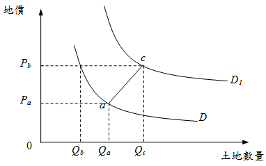

# 需求曲線後彎（需求法則例外的幻覺）,曾榮耀老師

## 文章資訊
- 文章編號：420421
- 作者：蘇偉強
- 發布日期：2020/11/26
- 關鍵詞：土地經濟學、需求曲線後彎
- 爬取時間：2025-02-02 21:01:49
- 原文連結：[閱讀原文](https://real-estate.get.com.tw/Columns/detail.aspx?no=420421)

## 內文
我的台中土地經濟學課程即將於下週日開課，有興趣同學歡迎來聽看看。今日專欄為各位說明有關需求曲線後彎的情形，而經濟學則認為這是一種需求法則例外的幻覺：

當地價快速上漲，土地投機盛行，買方預期價格會持續上漲，故反而追漲不追跌，使需求線往右移動，而如果右移幅度夠大，則價格提高反而帶來更多需求量，使結果看起來像是需求法則的例外情況，類似季芬財（Giffen goods）現象。

以下圖為例，在D需求線上，當地價由Pa上升至Pb，土地需求量理應由Qa減至Qb，但若消費者預期價格上漲，而使需求線由D右移至D1，則對應於Pb，需求量反而增加為Qc。從事後結果來看(a點移動至c點)，[圖片1]線段似乎為正斜率的需求線。但實際上，[圖片2]並不是需求線，只是不同需求線上的點，移動所形成的價量軌跡。

[圖片3]

## 文章圖片

## 文章圖片

## 文章圖片

---
*注：本文圖片存放於 ./images/ 目錄下*
