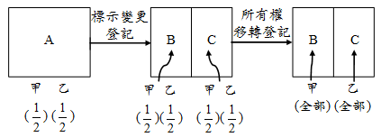
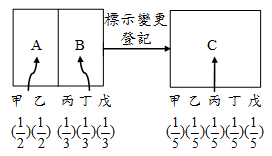

# 共有土地之分割與合併（上）,許文昌老師

## 文章資訊
- 文章編號：420838
- 作者：許文昌
- 發布日期：2021/01/07
- 爬取時間：2025-02-02 21:03:13
- 原文連結：[閱讀原文](https://real-estate.get.com.tw/Columns/detail.aspx?no=420838)

## 內文
茲分土地登記、土地增值稅及土地法第34條之1多數決等三方面說明。

(一)土地登記：

1. 共有土地分割：共有土地分割如涉及標示變更（即標示分割）及權利變更（即權利分割），應先辦理標示變更登記，再辦理所有權移轉登記。如甲、乙二人共有一筆A地，應有部分各二分之一，今擬將A地分割為B地及C地，B地歸甲所有，C地歸乙所有。辦理過程如下：

[圖片1]

首先，申請土地複丈，將A地一筆地號分割為B地與C地二筆地號，並辦理標示變更登記。辦竣後，B地及C地之權利範圍分別為甲應有部分二分之一，乙應有部分二分之一。接著，辦理所有權移轉登記，B地之乙的二分之一移轉於甲，C地之甲的二分之一移轉於乙。最後，甲取得B地之所有權全部，乙取得C地之所有權全部。綜上，共有土地分割如涉及標示變更及權利變更，應分兩階段辦理登記。亦即，先辦理標示變更登記，再辦理所有權移轉登記（詳土地登記規則第105條）。須注意者，共有土地分割如僅涉及標示變更而未涉及權利變更，則僅辦理標示變更登記；如僅涉及權利變更，而未涉及標示變更，則僅辦理所有權移轉登記。

2. 共有土地合併：共有土地合併，不問有無涉及權利變更，僅辦理標示變更登記。如甲、乙二人共有一筆A地，應有部分各二分之一，丙、丁、戊三人共有一筆B地，應有部分各三分之一，今擬將A地與B地合併為C地，應有部分各五分之一。辦理過程如下：

[圖片2]

上例，共有土地合併涉及標示變更（即標示合併）及權利變更（即權利合併），因無法分兩階段辦理登記，故僅辦理標示變更登記，無須辦理所有權移轉登記。

## 文章圖片

---
*注：本文圖片存放於 ./images/ 目錄下*
