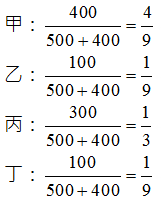

# 土地法第34條之1有關土地合併之實例研習,許文昌老師

## 文章資訊
- 文章編號：421114
- 作者：許文昌
- 發布日期：2021/02/04
- 爬取時間：2025-02-02 21:04:06
- 原文連結：[閱讀原文](https://real-estate.get.com.tw/Columns/detail.aspx?no=421114)

## 內文
A地與B地相毗鄰，A地之公告土地現值為500萬元，B地之公告土地現值為400萬元。A地由甲、乙二人共有，甲之應有部分為五分之四，乙之應有部分為五分之一。B地由丙、丁二人共有，丙之應有部分為四分之三，丁之應有部分為四分之一。今，A地與B地擬進行合併，甲、丙二人同意，乙、丁二人反對，則依土地法第34條之1進行合併是否可行？又，合併後各共有人之應有部分為何？

【解答】

(一)土地法第三十四條之一執行要點第5點第2項規定：「二宗以上所有權人不相同之共有土地或建物，依本法條規定申請合併，應由各宗土地或建物之共有人分別依本法條規定辦理。」準此，就A地而言，甲同意，乙不同意，同意之應有部分已超過三分之二，人數可以不計算；就B地而言，丙同意，丁不同意，同意之應有部分已超過三分之二，人數可以不計算。是故，A地與B地得依土地法第34條之1多數決進行合併。

(二)土地法第三十四條之一執行要點第8點第7款規定；「申請合併之共有土地地價不一者，合併後各共有人之權利範圍，應以合併前各共有人所有土地之地價與各宗土地總地價之和之比計算，並不得影響原設定之他項權利。」準此，合併後，各共有人之應有部分如下：[圖片1]

## 文章圖片

---
*注：本文圖片存放於 ./images/ 目錄下*
