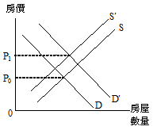

# 通貨膨脹對房價之影響,許文昌老師

## 文章資訊
- 文章編號：902686
- 作者：許文昌
- 發布日期：2021/12/16
- 爬取時間：2025-02-02 19:39:58
- 原文連結：[閱讀原文](https://real-estate.get.com.tw/Columns/detail.aspx?no=902686)

## 內文
所稱通貨膨脹，指短期間，一般物價普遍且持續上漲。最近，各國皆有通貨膨脹之跡象，基本原因有三：

新冠病毒疫情下，各國皆採寬鬆貨幣政策，以振興經濟。市場上，貨幣供給量增加，過多的貨幣追逐過少的財貨，造成物價上漲。

新冠病毒疫情下，隔離、封城、塞港等現象，造成勞動力銳減，生產大受影響。財貨需求不變下，財貨供給減少，供不應求，造成物價上漲。

美中貿易戰及新冠病毒疫情，生產供應鏈斷鏈，保護主義抬頭，生產成本提高，造成物價上漲。

我國原物料大都由國外進口，因而發生輸入型通貨膨脹。通貨膨脹發生，因貨幣不斷貶值，民眾將寧願保有實體財產（如房地產、黃金等），而不願握有貨幣，因而對房屋保值性需求由D提高至D’。如圖所示。另一方面，建設公司為因應通貨膨脹將採取先建後售或將通貨膨脹因素所造成預期營建成本上升提前反映於房屋售價上，因而供給減少或成本增加，房屋供給曲線由S左上移至S’。最後，房價由P0大幅上漲至P1。

[圖片1]

## 文章圖片

---
*注：本文圖片存放於 ./images/ 目錄下*
