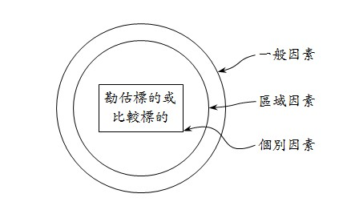
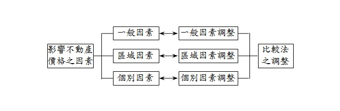

# 比較法何以無一般因素調整？,許文昌老師

## 文章資訊
- 文章編號：906594
- 作者：許文昌
- 發布日期：2022/12/29
- 關鍵詞：一般因素、區域因素、個別因素
- 爬取時間：2025-02-02 19:53:55
- 原文連結：[閱讀原文](https://real-estate.get.com.tw/Columns/detail.aspx?no=906594)

## 內文
• (一) 一般因素、區域因素及個別因素：

影響勘估標的或比較標的價格之因素，可分為一般因素、區域因素及個別因素等三個層次。如圖1所示。

1. 一般因素：指對於不動產市場及其價格水準發生全面影響之自然、政治、社會、經濟等共同因素（估技§2，估技代表不動產估價技術規則）。

2. 區域因素：指影響近鄰地區不動產價格水準之因素（估技§2）。

3. 個別因素：指不動產因受本身條件之影響，而產生價格差異之因素（估技§2）。

[圖片1]

圖1 影響不動產價格之因素

• (二) 區域因素調整及個別因素調整：

比較法係以比較標的價格為基準，經過情況、價格日期、區域因素及個別因素等四項調整，以推算勘估標的價格之方法。其中，區域因素調整及個別因素調整之意涵如下：

1. 區域因素調整：所選用之比較標的與勘估標的不在同一近鄰地區內時，為將比較標的之價格轉化為與勘估標的同一近鄰地區內之價格水準，而以比較標的之區域價格水準為基礎，就區域因素不同所產生之價格差異，逐項進行之分析及調整（估技§19）。

2. 個別因素調整：以比較標的之價格為基礎，就比較標的與勘估標的因個別因素不同所產生之價格差異，逐項進行之分析及調整（估技§19）。

• (三) 兩者連結（如圖2所示）：

1. 一般因素與一般因素調整之連結：勘估標的與比較標的同位於國內，一般因素相同，則無須進行一般因素調整。實務上，所蒐集比較標的大都為國內交易案例，鮮少國外交易案例，故比較法無一般因素調整。但如勘估標的為台灣之國際連鎖飯店或百貨公司，若國外地區（如香港、上海、東京、曼谷等）屬於同一供需圈，所蒐集比較標的為國外交易案例，因二國之政經情況不同，則必須進行一般因素調整。

2. 區域因素與區域因素調整之連結：勘估標的與比較標的位於同一近鄰地區，區域因素相同，則無須進行區域因素調整。相反地，勘估標的與比較標的不在同一近鄰地區，區域因素不相同，則必須進行區域因素調整。

3. 個別因素與個別因素調整之連結：不動產具有異質性。勘估標的與比較標的之個別因素不同，則必須進行個別因素調整。

[圖片2]

圖2 影響不動產價格之因素與比較法之調整的連結

## 文章圖片

## 文章圖片

## 文章圖片

---
*注：本文圖片存放於 ./images/ 目錄下*
