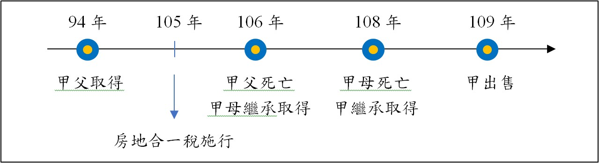

# 連續多次繼承之房地合一稅課徵認定：臺中高等行政法院110訴字第161號判決,曾榮耀老師

## 文章資訊
- 文章編號：907121
- 作者：蘇偉強
- 發布日期：2023/02/21
- 爬取時間：2025-02-02 19:56:03
- 原文連結：[閱讀原文](https://real-estate.get.com.tw/Columns/detail.aspx?no=907121)

## 內文
■案例事實：

甲的父親於94年2月22日購買A房地，後於106年7月25日死亡，為考量喪偶心情，甲與其母協議將系爭房地全數辦理分割繼承登記予其母，嗣後母於民國108年7月5日死亡，原告繼承取得該A房地，並於同年8月12日辦妥分割繼承登記，以及於109年1月21日以買賣為原因，將系爭房地移轉登記與丙，並依限於同年2月18日辦理房地合一稅申報。國稅局核定課稅所得3,144,018元，按適用稅率20%，核定應納稅額628,803元。原告不服，申請復查，未獲變更，訴願決定亦予維持，遂提起本件行政訴訟。

[圖片1]

爭議點：依所得稅法，甲房地持有期間計算，是算到母親取得，還是可算到其父親取得時，將影響其適用新、舊制，以及稅率之問題。

■先來看看原告理由，這是目前許多人也有碰到的誤解：

原告主張出售之系爭房地自94年起即105年所得稅法新法施行前為原告家庭所持續持有，持有期間已超過15年，顯非短期炒作投資，自原始持有94年起算，更應適用財政部104年8月19日台財稅字第10404620870號令(下稱財政部104年8月19日令)之例外適用舊法課徵所得稅之情形。

其中，按財政部104年8月19日令對於「被繼承人」之定義，並未限縮於「一世代」，亦未有僅限於直接繼承之情形，被告擴張解釋遽認原告繼承自父親之系爭房地，有違租稅法定主義之虞。又所得稅法第4條之4第1項及第14條之4第4項觀之，僅規定「第4條之4第1項第1款、第4條之5第1項第1款及前項有關期間之規定，於繼承或受遺贈取得者，得將被繼承人或遺贈人持有期間合併計算。」並無限定「被繼承人」為單純繼承或再轉（多次）繼承之情形，且所得稅法第14條之4第4項規定，繼承取得者，得將被繼承人持有期間合併計算，亦即被繼承人之取得原因如為繼承取得者，則應追溯至最前手被繼承人之取得日期，始符立法目的。（此案件關鍵爭議在此！）

■國稅局理由：

原告之被繼承人為甲母，依行為時所得稅法第14條之4第4項規定，僅得併計甲母持有系爭房地期間，與甲父取得時點無涉。又有關個人105年1月1日以後交易因連續多次繼承取得之房屋、土地，究應如何認定「被繼承人」取得時點、計算持有期間及其適用稅率疑義，經財政部於109年5月25日以台財稅字第10904508590號函復：「有關納稅義務人交易因繼承取得房屋、土地(下稱房地)，倘該房地係被繼承人於105年1月1日以後取得者，尚無本部104年8月19日台財稅字第10404620870號令規定之適用。」（也就是被繼承人在105年後取得者，就會適用新制房地合一稅）甲母係於106年7月25日取得系爭房地，並非於104年12月31日以前取得，核與財政部104年8月19日令規定不符，自無該令釋規定得適用舊制之餘地。另被告機關已依行為時所得稅法第14條之4第4項規定，計算持有期間為甲母取得日106年7月25日起至甲交易之日109年1月21日（移轉登記與買受人）止，超過2年，未逾10年（注意這個案件適用房地合一1.0，如果是現在的房地合一2.0版本，稅率會是35%「超過2年未逾5年」），適用稅率為20%。是甲主張持有期間應自其父親購買取得日94年起算，應適用舊制課稅，核無足採。

■行政法院判決：

1. 依本件應適用行為時所得稅法第14條之4第4項規定「得將被繼承人持有期間合併計算」之文義，並未明定包括納稅義務人之再轉繼承之被繼承人，且該項關於繼承取得者，得將被繼承人持有期間合併計算之例外規定，旨在合理必要範圍內適度減輕新制實施之影響，故適用上不宜擴張解釋，應認該項規定之被繼承人係指納稅義務人之被繼承人，不包括再轉繼承之被繼承人，故僅合併計算納稅義務人與被繼承人之持有期間。

2. 關於行為時所得稅法第14條之4第4項及房地合一課徵所得稅申報作業要點第5點第1項第1款前段規定「得將被繼承人持有期間合併計算」，應僅指納稅義務人之被繼承人持有期間可合併計算；本件雖有「連續多次繼承取得房地」之情形，惟僅得合併計算甲及其被繼承人甲母持有系爭房地之期間，無從將甲父親持有期間依行為時所得稅法第14條之4第4項規定合併計算。

3. 本件「連續二次繼承取得」系爭房地之事實，除甲之母死亡時即108年7月5日繼承取得外，其前一次係甲之父於106年7月25日死亡由其母親繼承之時，依前開說明，僅合併計算原告及其被繼承人即母親持有系爭房地之期間，不再合併甲父親持有之期間。故本件無從將甲父持有期間依行為時所得稅法第14條之4第4項規定合併計算，或主張合併計算連續多次繼承取得房地持有期間，認定甲之被繼承人母親的被繼承人即甲的父親取得系爭房地在104年12月31日前，而適用財政部104年8月19日令釋之內容主張依舊制計算財產交易所得稅。

因此，被告以原告於108年7月5日繼承且其被繼承人係於106年7月25日取得系爭房地，並於109年1月21日出售系爭房地為由，核定系爭房地交易課稅所得額3,144,018元，按適用稅率20%（現制應為35%），核定應納稅額628,803元，並無違誤。

■結論

繼承僅算至前一手，即該次被繼承人的持有期間而已，並不會一直往回合併加計連續多次繼承取得持有期間！

## 文章圖片

---
*注：本文圖片存放於 ./images/ 目錄下*
