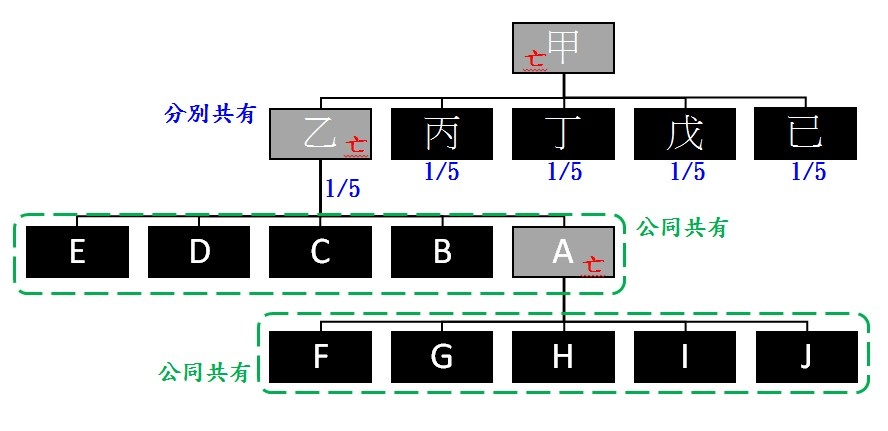

# 公同共有繼承之分割方法：103年度重簡字第544號民事判決,曾榮耀老師

## 文章資訊
- 文章編號：907334
- 作者：蘇偉強
- 發布日期：2023/03/14
- 爬取時間：2025-02-02 19:56:46
- 原文連結：[閱讀原文](https://real-estate.get.com.tw/Columns/detail.aspx?no=907334)

## 內文
一、案例

甲於民國66年過世，其名下不動產由其繼承人辦理繼承登記，並分割遺產完畢，其中甲之配偶乙繼承登記為分別共有5分之1，該分別共有之5分之1即為本件系爭分割之標的，嗣乙於69年死亡，其繼承人有A、B、C、D、E共5人，依繼承關係為公同共有，每人潛在部分之比例應為5分之1，而A復於79年過世，A就被繼承人乙之公同共有部分即由其繼承人F、G、H、I、J等5人與B、C、D、E公同共有。而後遲至102年始辦妥公同共有之繼承登記。B是否得訴請裁判分割？如何分割？

[圖片1]

二、說明

(一) 即使完成公同共有繼承登記仍屬得隨時請求分割之遺產

雖已完成公同共有登記，但該原屬乙的1/5之應有部分仍為遺產，故按繼承人有數人時，在分割遺產前，各繼承人對於遺產全部為公同共有（民1151）；繼承人得隨時請求分割遺產。但法律另有規定或契約另有訂定者，不在此限（民1164）。因此，在遺產並無不能分割之情形，亦無不分割之約定，B得以請求遺產分割。

(二) 公同共有繼承關係因遺產分割而終止

由於公同關係存續中，各公同共有人，不得請求分割其公同共有物（民829），故請求遺產分割實際同時就公同關係予以終止，即民830規定公同共有之關係，自公同關係終止，或因公同共有物之讓與而消滅。

(三) 公同共有物分割方法

公同共有物分割之方法，除法律另有規定外，準用關於共有物分割之規定（民830 II）。亦即共有人就共有物之分割方法不能協議決定者，法院得因任何共有人之請求，命為下列之分配：1.以原物分配於各共有人，但各共有人均受原物之分配顯有困難者，得將原物分配於部分共有人；2.原物分配顯有困難時，得變賣共有物，以價金分配於各共有人，或以原物之一部分分配於各共有人，他部分變賣，以價金分配於各共有人。以原物為分配時，如共有人中，有未受分配，或不能按其應有部分受分配者，得以金錢補償之。

至於選擇哪一種分割分配方法，分割共有物究以原物分割或變價分割為適當，法院應斟酌當事人意願、共有物之使用情形、經濟效用及全體共有人之利益等情形而為適當之分割，不受共有人所主張分割方法之拘束（最高法院88年台上字第600號裁判要旨參照）。

綜上所述，在分割遺產前，對於遺產全部為公同共有，因上開遺產並無不能分割之情形，亦無不分割之約定，故如上開遺產不能協議分割，則B以遺產分割為由終止公同共有關係，請求分割乙之遺產，自屬有據。

至於分割分配方法，由於系爭房地之共有人眾多，部分共有人應有部分極少，若採原物分割之方式，勢必造成細分而導致經濟價值大幅減損，造成經濟上之不利益，因此若以變賣系爭遺產，以價金分配於兩造之分割方法，係為妥適公允之分割方法，並能徹底解決公同共有關係及杜絕兩造爭議，是本件就系爭遺產宜採變價方式，再按各公同共有人之應繼分比例分配，對於全體公同共有人最為有利。

參考來源：臺灣新北地方法院103年度重簡字第544號民事判決、88年度台上字第600號

## 文章圖片

---
*注：本文圖片存放於 ./images/ 目錄下*
