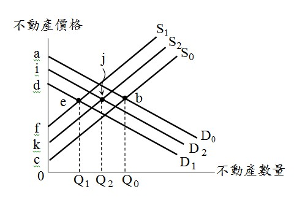

# 交易成本,許文昌老師

## 文章資訊
- 文章編號：907535
- 作者：許文昌
- 發布日期：2023/04/06
- 爬取時間：2025-02-02 19:57:29
- 原文連結：[閱讀原文](https://real-estate.get.com.tw/Columns/detail.aspx?no=907535)

## 內文
(一) 交易成本之意義

交易成本（ Transaction Cost ），指交易過程中所必須負擔之成本。以買賣為例，買方必須負擔交易成本，賣方亦須負擔交易成本。

交易成本有別於生產成本。前者係因交易而產生，後者係因生產而產生。

(二) 交易成本之內容

1. 搜尋資訊之成本：買方擬購買不動產，必須蒐集資訊，以避免買貴。同理，賣方擬出售不動產，必須蒐集資訊，以避免賤售。因此，買賣雙方均有蒐集資訊之成本。

2. 雙方議價尋求真實價格之成本：買賣雙方討價還價，最後達成一致價格。因此，買賣雙方均有協商議價之成本。

3. 訂定契約之成本：買賣雙方簽訂契約，必須對契約內容逐條審視，以避免契約內容不利於己，而造成交易風險。因此，買賣雙方均有簽訂契約之成本。

4. 監視與執行契約之成本：買賣雙方依契約規定行使權利及履行義務。買方監視對方，是否如期辦理過戶登記；賣方監視對方，是否如期交付款項。因此，買賣雙方均有監視對方履行之成本。

5. 保護財產權排除他人侵權之成本：契約履行結果，買方取得不動產，賣方取得價金。如有一方違約，另一方行使請求權，訴請法院強制執行。因此，雙方均有保護財產權排除他人侵權之成本。

(三) 不動產交易成本偏高

不動產交易與其他財貨交易一樣，均存在交易成本。然，不動產交易成本偏高，其理由如下：

1. 不動產具有異質性：每一件不動產都不一樣，因此買方購買不動產必須精挑細選，並赴現場看屋。

2. 不動產無集中市場：股票有集中市場，故其交易成本低。不動產無集中市場，故其交易成本高。

3. 不動產資訊不流通：不動產交易資訊較其他財貨封閉。不動產交易資訊不流通、不正確及不對稱，造成不動產交易成本高。

4. 不動產交易金額大：不動產屬於高價財貨，買賣交易須特別謹慎，稍有不慎，將損失慘重。因此，不動產交易之議價時間長，預防措施多，故不動產交易成本高。

5. 不動產過戶手續繁瑣：不動產交易必須辦理移轉登記。過戶手續繁複、時間拉長、風險增高，造成不動產交易成本高。

(四)交易成本對不動產市場之影響

如圖所示，D0代表無交易成本之不動產需求曲線，S0代表無交易成本之不動產供給曲線。由D0與S0之交點b，決定不動產交易數量Q0。當不動產買賣存在交易成本，因買方有交易成本而使D0左下移至D1，因賣方有交易成本而使S0左上移至S1。由D1與S1之交點e，決定不動產交易數量Q1。不動產買賣因存在交易成本，不動產交易量由Q0減少至Q1，社會福利由△abc縮小為△def。

[圖片1]

(五)實價登錄與新科技應用對交易成本之影響

1. 實價登錄：政府推行實價登錄，不動產交易資訊更充分、更透明、更正確，減少買賣雙方搜尋資訊之成本，因而降低交易成本。如圖所示，D1代表實價登錄實施前之不動產需求曲線，S1代表實價登錄實施前之不動產供給曲線。由D1與S1之交點e，決定不動產交易量Q1。嗣實價登錄推行，買方之交易成本降低，而使D1右上移至D2，賣方之交易成本降低而使S1右下移至S2。由D2與S2之交點j，決定不動產交易量Q2。實價登錄推行，不動產交易量由Q1增加至Q2，社會福利由△def擴大為△ijk。最有效率資源配置之交易量在Q0。因不動產買賣存在交易成本，而使資源配置之交易量Q1遠離最有效率資源配置之交易量Q0。實價登錄實施，降低交易成本，而使資源配置之交易量由Q1增加至Q2，更趨近最有效率資源配置交易量Q0。

2. 新科技應用：新科技應用可以降低交易成本。如買方可以先透過網路3D看屋，初步滿意後，才赴現場實地勘查，以減少不必要看屋之交易成本。展望未來，3D看屋進化至虛擬實境看屋，更可大幅度降低交易成本。

(六) 結論

1. 交易成本等於零，資源配置最有效率。沒有交易成本的世界，稱為「寇斯（Coase）的世界」。寇斯定理是建立在交易成本為零之理想境界。但現實社會，交易成本無所不在，因此，無法達成資源最有效率之配置。

2. 交易成本愈大，資源配置效率愈低。因此，如何降低交易成本，而且交易成本愈低愈好，俾往最有效率資源配置邁進。

3. 政府建立制度（如實價登錄、履約保證、定型化契約等），可以有效降低交易成本，增進市場效率。

## 文章圖片

---
*注：本文圖片存放於 ./images/ 目錄下*
