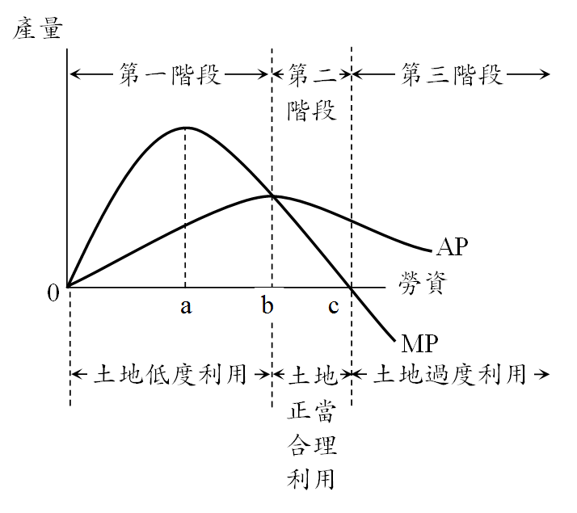

# 土地利用問題,許文昌老師

## 文章資訊
- 文章編號：909905
- 作者：許文昌
- 發布日期：2023/12/07
- 爬取時間：2025-02-02 20:06:33
- 原文連結：[閱讀原文](https://real-estate.get.com.tw/Columns/detail.aspx?no=909905)

## 內文
土地利用問題有三，一為土地低度利用，二為土地過度利用，三為土地不當利用。

(一)土地低度利用：指土地閒置不利用，或雖從事利用但未充分利用。如平均地權條例第3條第7款所稱空地及同法第26條之1所稱荒地，即是。

(二)土地過度利用：指土地利用超過土地之容受力，亦即土地利用超過土地之承載力。如宜林地作農牧使用、地價低廉地區興建高樓大廈等是。

(三)土地不當利用：即土地錯誤使用，指土地未按土地使用計畫所編定之用途使用。如農業區違規興建廠房、環境敏感地區從事土地開發等是。

如圖所示，AP代表平均產量曲線（Average Product Curve），MP代表邊際產量曲線（Marginal Product Curve）。在一塊土地上，不斷投入勞力資本，其邊際產量起初呈遞增現象，增加至某一點（即a點）以後，反呈遞減現象。此即報酬遞減法則、邊際報酬遞減法則、土地收穫遞減法則或土地法則。另，土地利用三階段，第一階段（勞資投入量從0至b）表示勞資投入量過少，產生土地低度利用問題，第二階段（勞資投入量從b至c）表示勞資與土地配合適當，屬於土地正當合理利用。第三階段（勞資投入量從c以後）表示勞資投入量過多，產生土地過度利用問題。總之，土地利用應落在第二階段。

[圖片1]

## 文章圖片

---
*注：本文圖片存放於 ./images/ 目錄下*
