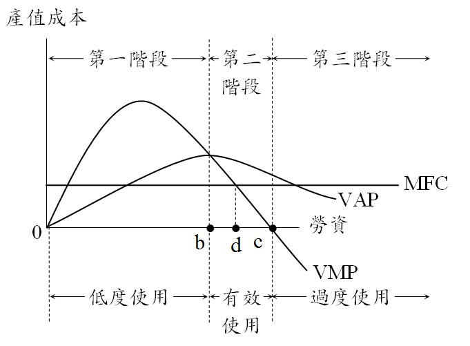

# 土地利用三階段與地盡其利,許文昌老師

## 文章資訊
- 文章編號：909991
- 作者：許文昌
- 發布日期：2023/12/14
- 爬取時間：2025-02-02 20:06:50
- 原文連結：[閱讀原文](https://real-estate.get.com.tw/Columns/detail.aspx?no=909991)

## 內文
地盡其利為土地利用之目標。地盡其利之涵義，相當於不動產估價技術規則第2條第17款規定之「最有效使用」定義，指客觀上具有良好意識及通常之使用能力者，在合法、實質可能、正當合理、財務可行前提下，所作得以獲致最高利益之使用（估技§2）。

茲分析地盡其利之構成條件：

(一)符合法規使用：土地利用須符合法規規定，包括地政法規、都市計畫法規、建築法規、環保法規等。另，國土計畫、區域計畫、都市計畫等土地使用計畫及管制，亦屬於法規內涵。

(二)正當合理使用：土地利用不得低度使用、過度使用及錯誤使用。又，勞資與土地須配合適當，勞資投入量應落在土地利用三階段之第二階段。

(三)財務可行使用：土地開發利用之財務規劃須健全，如土地投資之淨現值為正、預期報酬率大於必要報酬率、財務槓桿為正槓桿等。

(四)獲利最高使用：在符合法規、正當合理及財務可行之使用前提下，獲得最高利益之使用。亦即，生產用地在追求最大利潤之使用、消費用地在追求最大效用之使用。

如圖所示，在一塊土地上，不斷投入勞力資本，VAP代表平均產值曲線（Value of Average Product Curve），VMP代表邊際產值曲線（Value of Marginal Product Curve），MFC代表邊際要素成本曲線（Marginal Factor Cost Curve）。當勞資投入量從0至b為土地利用第一階段，此階段之勞資投入量過少，表示土地低度使用。當勞資投入量從b至c為土地利用第二階段，此階段之勞資與土地配合適當，表示土地正當合理使用或土地有效使用。當勞資投入量從c以後為土地利用第三階段，此階段之勞資投入量過多，表示土地過度使用。由此可知，土地使用應落在第二階段。

土地於有效使用中，進而追求最有效使用。亦即，就第二階段的勞資投入量b與c之間，找尋最有效使用的一點。如圖所示，依邊際產值等於邊際要素成本原則，決定勞資投入量為d，此點為最有效使用。

[圖片1]

## 文章圖片

---
*注：本文圖片存放於 ./images/ 目錄下*
