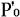
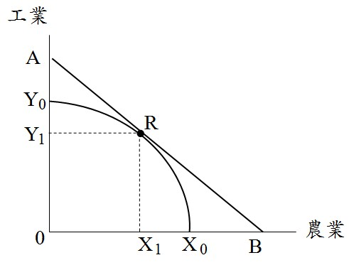
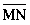
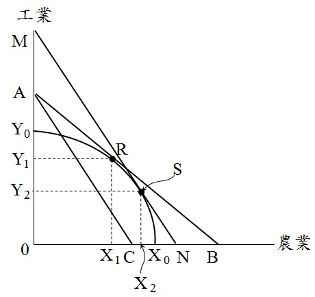
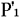
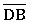
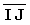
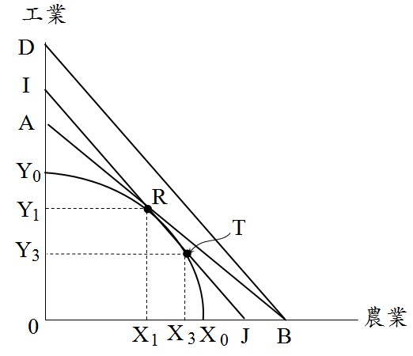

# 農工爭地,許文昌老師

## 文章資訊
- 文章編號：910147
- 作者：許文昌
- 發布日期：2023/12/28
- 爬取時間：2025-02-02 20:07:29
- 原文連結：[閱讀原文](https://real-estate.get.com.tw/Columns/detail.aspx?no=910147)

## 內文
一、農工爭地之意義

發展工業需要工業用地，生產糧食需要農業用地。但台灣之土地資源畢竟有限，如何妥善規劃用地需求，以維持工業發展與農業生產之均衡。

二、考慮外部性之用地需求

如圖(一)所示，台灣土地如果全部用於農業生產，農業產量X0；如果全部用於工業生產，工業產量Y0。設農業平均價格P0，工業平均價格[圖片1]，則等收益線[圖片2]。生產可能曲線X0Y0弧線與等收益線[圖片3]之相切，切點R，決定農業產量X1，工業產量Y1。

[圖片4]

圖(一) 農業產量與工業產量之最適組合

(一)考慮農業生產外部利益：農業之多功能性，農業生產具有外部利益，因此對農業之評價由P0上升為P1。如圖(二)所示，等收益線由[圖片5]移至[圖片6]。將[圖片7]平行外移至[圖片8]，且與生產可能曲線相切，切點S。此時，農業產量由X1增加至X2，工業產量由Y1減少至Y2。總之，考慮農業之外部利益，增加農業用地，以增加農業產量；減少工業用地，以減少工業產量。

[圖片9]

圖(二) 考慮農業外部利益之產量變化

(二)考慮工業生產之外部成本：工業造成環境污染，工業生產具有外部成本，因此對工業之評價由[圖片10]下降為[圖片11]。如圖(三)所示，等收益線由[圖片12]移至[圖片13]。將[圖片14]平行內移至[圖片15]，且與生產可能曲線相切，切點T。此時，農業產量由X1增加至X3，工業產量由Y1減少至Y3。總之，考慮工業之外部成本，增加農業用地，以增加農業產量；減少工業用地，以減少工業產量。

[圖片16]

圖(三) 考慮工業外部成本之產量變化

## 文章圖片

---
*注：本文圖片存放於 ./images/ 目錄下*
